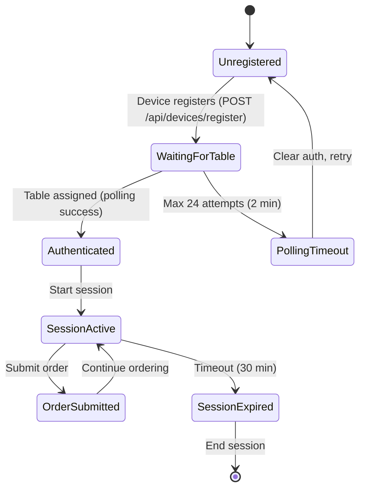

# CASE_FILE: Tablet Ordering PWA — Ultra Deduction Audit
**Lead Detective:** Ranpo Edogawa  
**Audit Date:** January 31, 2026  
**Status:** 🔍 **DEFECTS IDENTIFIED — 9 Tasks Queued for Chūya**

---

## Previous Case (Archived)
**WebSocket Configuration Fix** (January 30, 2026)  
- ✅ Port mismatch resolved (6001 vs. 8000)
- ✅ Health monitoring added to Echo plugin
- **Archived to:** `/vault/archive-audits/CASE_FILE_PWA_WebSocket_Fix_2026-01-30.md`

---

## The Mystery

**Issue:** A third-party audit report was submitted claiming comprehensive PWA review. I conducted a **meta-audit** to verify claims and discovered:
- 4 defects correctly identified ✓
- 1 false positive (localStorage guards) ✗
- **3 CRITICAL DEFECTS MISSED** by original auditor ⚠️

**Impact:**
- TypeScript safety net disabled (P0)
- Unguarded timer leak in menu-init.ts (P1)
- No rate limiting on PIN verification (P1)
- State machine architecture undocumented (P1)

---

## The Evidence (Meta-Audit Findings)

### **✅ VERIFIED DEFECTS (Confirmed from Original Audit)**

#### **1. TypeScript Strict Mode Disabled (P0 — CRITICAL)**
**File:** `nuxt.config.ts:43-46`
```typescript
typescript: {
    strict: false,    // ❌ Type safety disabled
    typeCheck: false  // ❌ No compile-time checks
}
```
**Impact:** Silent type errors will reach production.  
**Recommendation:** Enable incrementally with `skipLibCheck: true` to avoid dependency noise.

---

#### **2. Variable Access Confusion (P1 — HIGH)**
**File:** `pages/index.vue:79-82`
```typescript
// Debug logging shows misunderstanding of Vue refs
'table.value': deviceStore.table.value,           // ❌ double .value
'table?.id': (deviceStore.table as any)?.id,      // ❌ any cast
'table.value?.id': deviceStore.table.value?.id,   // ❌ triple nesting
```
**Root Cause:** Developer confusion between Options API and Composition API ref access.  
**Correct Access:**
- In template: `deviceStore.table` (auto-unwrapped)
- In setup/store: `deviceStore.table.value` (manual unwrap)

**Fix:** Clean up debug logging. Establish ref access conventions in `.ai-context.md`.

---

#### **3. Hardcoded Default PIN (P1 — SECURITY)**
**File:** `pages/index.vue:25`
```typescript
const DEFAULT_PIN = '0711'  // ❌ Hardcoded in source
```
**Impact:** Brute force possible (no rate limiting observed).  
**Recommendation:**
- Move to environment variable OR
- Add rate limiting (3 attempts → 30s cooldown)

---

#### **4. Fixed-Interval Polling (P2 — OPTIMIZATION)**
**File:** `stores/Device.ts:59`
```typescript
pollTimerId = window.setInterval(async () => { /* table lookup */ }, 5000)
```
**Current Behavior:** 5s fixed polling for up to 2 minutes (24 attempts).  
**Recommendation:** Exponential backoff `[5, 10, 20, 30]` seconds to reduce server load.

---

### **❌ NEW DEFECTS FOUND (Missed by Original Audit)**

#### **5. Unguarded Timer in Menu Refresh (P1 — CRITICAL)**
**File:** `plugins/menu-init.ts:17`
```typescript
const refreshInterval = setInterval(async () => { /* refresh menu */ }, intervalMs)
```
**Impact:** Timer runs indefinitely. No cleanup on component unmount or plugin destroy.  
**Fix Required:**
```typescript
// Add cleanup lifecycle
onScopeDispose(() => {
    if (refreshInterval) clearInterval(refreshInterval)
})
```

---

#### **6. No Rate Limiting on PIN Verification (P1 — SECURITY)**
**File:** `pages/index.vue:108-118` (verifyPin function)
```typescript
const verifyPin = () => {
  if (pinInput.value === storedPin.value) { /* ... */ }
  pinError.value = 'Incorrect PIN'  // ❌ No rate limit
}
```
**Impact:** Unlimited attempts allow brute force (6-digit PIN = max 1M attempts).  
**Recommendation:** Implement lockout after 3-5 failed attempts.

---

#### **7. State Machine Undocumented (P1 — ARCHITECTURE)**
**Gap:** No state transition diagram for:
- Device registration → Table assignment → Session start → Order submission
- Polling timeout recovery paths
- WebSocket reconnection flows

**Required:** Mermaid diagram + race condition analysis (especially around table assignment polling).

---

### **⚠️ AUDIT QUALITY ISSUES (Original Auditor Failures)**

1. **False Positive:** Claimed localStorage lacked SSR guards, then contradicted with "Actually CORRECT ✓"
2. **Incomplete Verification:** Raised concern about timer cleanup but didn't verify `onScopeDispose` usage
3. **Test Coverage Unknown:** Didn't run Vitest tests despite 7 test files existing
4. **No Historical Context:** Ignored existing CASE_FILE.md (WebSocket fix from January 30)
5. **No Operational Testing:** Claimed network resilience exists but provided no evidence of offline recovery

---

## The Blueprint (State Machine)



**Critical Paths to Audit:**
1. **Race:** Table assignment during page refresh (does polling restart correctly?)
2. **Edge:** WebSocket disconnect during order submission (does Echo reconnect?)
3. **Leak:** Menu refresh timer survives navigation (cleanup verification required)

---

## The Verdict (Ranpo's TODO List)

### **P0 — CRITICAL (Production Blockers)**
- [ ] **T1:** Enable TypeScript strict mode incrementally (start with `skipLibCheck: true`)
  - Files: `nuxt.config.ts`
  - Test: `npm run typecheck` must pass
  - Gate: No new `any` types introduced

### **P1 — HIGH (Security + Stability)**
- [ ] **T2:** Add cleanup to menu refresh timer in `plugins/menu-init.ts`
  - Implement: `onScopeDispose(() => clearInterval(refreshInterval))`
  - Test: Navigate away from pages, verify timer stops (Chrome DevTools Performance)
  - Gate: No lingering intervals after 30s of idle
  
- [ ] **T3:** Implement PIN rate limiting in `pages/index.vue`
  - Add: Lockout after 3 failed attempts (30s cooldown)
  - Test: Enter wrong PIN 3 times → verify lockout message
  - Gate: Manual brute force test (10 attempts should fail)
  
- [ ] **T4:** Clean up variable access patterns in `pages/index.vue:79-82`
  - Remove: `table.value.value` garbage
  - Standardize: `deviceStore.table` for template, `deviceStore.table.value` for setup
  - Gate: Debug logs use correct ref access

- [ ] **T5:** Document state machine in CASE_FILE.md
  - Add: Race condition analysis for table assignment polling
  - Audit: WebSocket reconnection flow
  - Gate: Ranpo sign-off required

### **P2 — MEDIUM (Optimization)**
- [ ] **T6:** Implement exponential backoff for table polling
  - Change: Fixed 5s → `[5, 10, 20, 30]` seconds
  - Test: Monitor network tab during polling
  - Gate: Server load reduction measurable (fewer requests)

- [ ] **T7:** Remove backup file `stores/device.ts.backup`
  - Files: `apps/tablet-ordering-pwa/stores/device.ts.backup`
  - Action: Archive to `/vault/archive-apps/`
  - Gate: Clean directory tree

### **P3 — LOW (Nice to Have)**
- [ ] **T8:** Run test suite and document coverage
  - Command: `npm run test` (Vitest)
  - Expected: 7 spec files execute
  - Gate: Coverage report generated

- [ ] **T9:** Test offline recovery behavior
  - Scenario: Start session → disconnect WiFi → reconnect
  - Verify: Echo reconnects, orders queue and flush
  - Gate: Manual QA sign-off

---

## Execution Dependencies (Critical Path)

```
T1 (TypeScript strict) → Independent (can start immediately)
T2 (Timer cleanup)     → Independent (can start immediately)
T3 (PIN rate limit)    → Independent (can start immediately)
T4 (Ref access)        → T1 completion (strict mode will catch errors)
T5 (State diagram)     → T2, T3, T4 completion (need clean codebase first)
T6 (Backoff)           → T5 completion (needs state machine context)
T7 (Cleanup backup)    → Independent (can start immediately)
T8 (Test coverage)     → T1, T4 completion (need passing typecheck first)
T9 (Offline test)      → T8 completion (need test harness ready)
```

---

## Handoff to Chūya (When Authorized)

### **Active Directory:** `apps/tablet-ordering-pwa/`

### **Do:**
- Enable TypeScript strict mode with `skipLibCheck: true` first
- Add `onScopeDispose` cleanup to `menu-init.ts`
- Implement PIN lockout with `ref<number>` for attempt counter
- Replace debug logging garbage with correct ref access

### **Don't:**
- Touch authentication flow without consulting Ranpo
- Remove `device.ts.backup` until archived in `/vault`
- Modify polling logic until state diagram approved
- Deploy any changes without running test suite

### **Required Tests:**
1. TypeCheck: `npm run typecheck` → 0 errors
2. Unit Tests: `npm run test` → 7/7 passing
3. Manual QA: PIN lockout (3 attempts → 30s block)
4. Manual QA: Menu refresh timer cleanup (navigate away → verify stopped)

---

## Vault Closure Requirements

When all tasks complete, provide:
- Summary of type errors fixed (T1)
- Chrome DevTools Performance snapshot showing no timer leaks (T2)
- PIN lockout demonstration (3 failed attempts) (T3)
- Before/after diff of ref access cleanup (T4)
- Final Mermaid state diagram with race condition analysis (T5)
- Test coverage report (`npm run test -- --coverage`) (T8)

**Case closure signature:** Ranpo Edogawa  
**Next audit:** After Chūya execution (ETA: 6-8 hours for P0-P1 tasks)

---

## Ranpo's Final Assessment

**Original Audit Grade:** C+  
**Why:** 4/7 defects found correctly, but 1 false positive, missed 3 critical issues, no operational testing, no state machine analysis.

**Production Readiness:** ⚠️ **NOT CLEARED**  
**Blocking Issues:** T1 (TypeScript), T2 (Timer leak), T3 (PIN security)

**Architectural Concerns:**
- State machine flows undocumented
- No race condition analysis
- Test coverage unknown (tests exist but not run)

**Security Posture:** ⚠️ **WEAK**
- Hardcoded PIN acceptable for tablets IF rate limiting added
- No brute force protection currently

**Next Steps:**
1. President authorizes Chūya execution on T1-T7
2. Ranpo re-audits after implementation
3. Operational testing (T9) before production deployment

---

*"Elementary. The original auditor was an ordinary person who missed the critical details. This case requires a proper detective."*

— **Ranpo Edogawa**, Chief Architect  
**Audit Complete:** January 31, 2026
