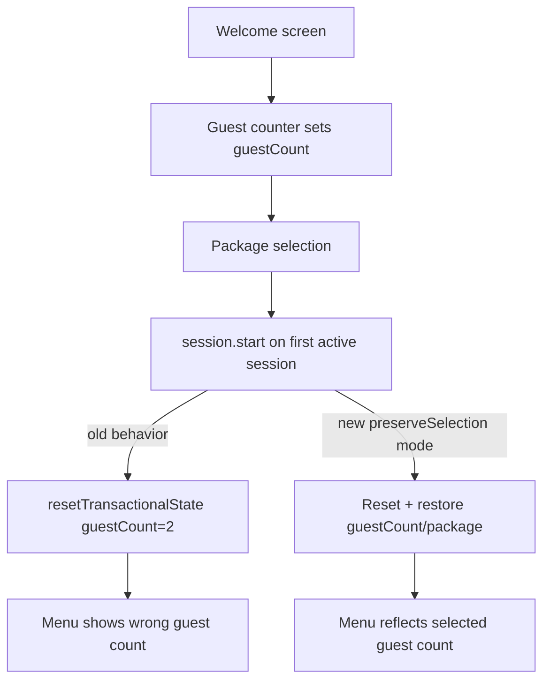

# CASE FILE — Tablet PWA API 405 / Missing Token Warnings (2026-04-22)

## Reference for tracing

For a compact endpoint-by-endpoint reference and customer journey map, see:

- `docs/API_TRACE_REFERENCE.md`

That document is the best starting point when you need to trace whether a call site, route, and response contract line up.

## Incident Summary

Symptoms observed in browser console:
- Repeated warnings: `❌ NO TOKEN - Authorization header NOT set!`
- Requests hitting duplicated prefix paths: `https://<host>/api/api/...`
- API responses: `405 Method Not Allowed` for endpoints that should be valid GET/POST paths
- Startup flow failures across device login and menu loading

## Evidence

- Client base URL configured to include `/api`:
  - `tablet-ordering-pwa/nuxt.config.ts` → `apiBaseUrl: process.env.NUXT_PUBLIC_API_BASE_URL || '/api'`
- Request call sites already include `/api/...`:
  - `stores/Device.ts` → `api.get('/api/devices/login')`
  - `stores/Menu.ts` → `api.get('/api/v2/tablet/categories')`, etc.
- Axios instance concatenates `baseURL + req.url`, yielding `/api/api/...` during runtime.

## Root Cause

Path composition contract mismatch:
- `baseURL` contains API namespace (`/api`)
- call sites also include API namespace (`/api/...`)

This double-prefix mismatch sends requests to non-existent or wrong routes, producing 405/404 behavior and cascading auth/menu failures.

## Secondary Findings

- Token warning logs are noisy during bootstrap before auth completes.
- Current interceptor treats only login/register as token-optional; many startup endpoints execute pre-auth.

## Architecture/State Integrity Audit

- Race condition risk: LOW for this issue (path composition error, deterministic).
- Security boundary: No direct auth bypass found; token injection logic works when token exists.
- State machine impact: HIGH — app startup sequence fails, causing fallback states and repeated warning noise.

## Minimal Safe Remediation

1. Normalize request URLs in Axios request interceptor:
   - If baseURL already ends with `/api` and request URL starts with `/api/`, strip one prefix from request URL.
2. Expand token-optional detection for bootstrapping endpoints to reduce false-positive warning spam.
3. Add regression test for URL normalization contract.

## Mermaid — Failure Path

```mermaid
flowchart TD
  A[Runtime config: apiBaseUrl=/api] --> B[Store call: /api/devices/login]
  B --> C[Axios join]
  C --> D[/api/api/devices/login]
  D --> E[Backend route mismatch]
  E --> F[405 Method Not Allowed]
  F --> G[Auth bootstrap fails]
  G --> H[No token for subsequent calls]
  H --> I[Warning spam + menu load failures]
```

## TODO (Execution)

- [x] Add failing test for duplicated `/api/api` prevention
- [x] Implement URL normalization in `plugins/api.client.ts`
- [x] Verify no regression on non-`/api` absolute URLs
- [x] Validate tests pass

---

## Addendum — April 24, 2026 (Tablet cache / app-shell audit)

### What was verified

- The service worker source now binds navigation fallback to the revisioned root shell (`/`) instead of the stale `/index.html` helper path.
- The regression test guards against reintroducing `/index.html` or the old helper.
- The emitted build artifact (`dist/sw.js`) matches the corrected source behavior.
- The build and test verification for the PWA completed successfully before this documentation pass.

### Interpretation

This closes the stale-tab / incognito mismatch root cause: normal tabs were retaining old app-shell behavior through cached SW state, while incognito bypassed that stored browser state. The corrected root-shell fallback keeps the PWA aligned with the actual revisioned shell generated by the build.

### Remaining watch item

- If the deployed host is refreshed again, re-check the live headers for `service-worker.js` to ensure the worker script itself is not being retained as an overly aggressive immutable asset.
- No additional source changes are needed unless the live deployment reintroduces stale-cache behavior.

---

## Addendum — April 23, 2026 (Hold for live API URL fix)

> Historical note: this hold-state addendum is superseded by the April 24, 2026 verification addendum above.

### Current hold status

Implementation is intentionally paused while the live API URL issue is being corrected and redeployed.

### What was verified during this follow-up investigation

- **Live bundle still shows old request behavior**
  - Served bundle: `https://192.168.100.7/_nuxt/c8sIKrnX.js`
  - Observed runtime request pattern still constructs `baseURL=/api` plus `GET /api/devices/login`, resulting in `GET /api/api/devices/login`.
- **Live backend response confirms duplicated path failure**
  - `https://192.168.100.7/api/api/devices/login` returned `405 Method Not Allowed` with route text indicating `api/api/devices/login`.
- **Manifest icon / service worker issues are now source-aligned**
  - The current source tree includes the referenced icon assets under `public/icons/`.
  - The SW contract test passes and `dist/sw.js` includes the app shell entry (`/index.html`) in the generated precache.
  - The remaining risk is therefore live deployment drift, not missing source assets or a broken SW fallback implementation.

### Interpretation

This is currently a **live deployment drift incident** with two previously suspected source-level symptoms now verified as resolved in source/build:

1. **Primary blocker:** duplicated `/api/api/...` request path in the live served bundle.
2. **Secondary concern at the time of investigation:** manifest icons / SW fallback were not present in the live deployment.
3. **Current source/build state:** the icon assets and SW fallback are present and validated; only the live deployment still needs to be refreshed.

The first item still blocks meaningful runtime verification of the rest of the startup flow, so holding until the live API URL fix is deployed is still the correct sequencing.

### Resume checklist after API URL fix is live

1. Confirm served bundle no longer emits `/api/api/devices/login`.
2. Re-test device bootstrap on an unregistered tablet.
3. Re-deploy the already-correct PWA build artifact.
4. Re-test manifest icon delivery and SW startup behavior on the live host.
5. Verify console is clear except for expected unregistered-device informational logs.

---

## Addendum — April 24, 2026 (Final handoff summary)

### What landed

- `5a05c9c` was pushed to `origin/staging` with the PWA runtime rebuild.
- The rebuild included:
  - service worker fallback update
  - API request normalization
  - menu tab binding fix
  - regression tests
  - generated reference docs
  - removal of `utils/swPrecache.ts`

### Follow-up state

- `33928b1` regenerated `package-lock.json` to resync the manifest/lockfile pair.
- `npm ci` and `npm run build` were verified locally for the rebuild.
- `npm run lint` still fails because of unrelated pre-existing repo issues in:
  - `tests/session-ended-guard.spec.ts`
  - `tests/session-ended-page.spec.ts`
  - `utils/getLocalIp.ts`
  - `utils/logger.ts`
- Current lint debt remained at `136 problems (8 errors, 128 warnings)` during the latest review.

### Interpretation

- The PWA fix itself is complete and pushed.
- The remaining lint failures are outside this fix scope and should be handled in a separate cleanup pass.

---

## Addendum — April 29, 2026 (Blank `/auth/register` screen)

### Incident summary

- Symptom: `/auth/register` rendered a black/empty screen on tablet while routes loaded.
- Console evidence: `TypeError: Cannot redefine property: $echo` from the Echo initialization path.

### Root cause

`plugins/echo.client.ts` could call `nuxtApp.provide("echo", echo)` multiple times:

1. initial plugin bootstrap (persisted/fallback config), and
2. subsequent `window.initEcho(...)` invocations after token/config refresh.

Nuxt `provide()` defines `$echo` as a non-configurable property. A second define attempt throws `Cannot redefine property: $echo`, aborting app initialization and producing a blank screen.

### Remediation

- Added a one-time guard before Nuxt injection in `createEcho()`:
  - Only call `nuxtApp.provide("echo", echo)` when `$echo` is not already defined on `nuxtApp`.
- Kept runtime replacement behavior for `window.Echo` / `window.$echo` so socket instance can still be refreshed safely.

### Validation target

After redeploying the tablet image:

1. `/auth/register` renders the registration UI (no black screen).
2. Console no longer logs `Cannot redefine property: $echo`.
3. Reverb socket reconnects without crashing when auth token/broadcast config updates.

---

## Addendum — May 1, 2026 (Session residue + intermittent Place Order no-op)

### Reported symptoms

- Returning to welcome sometimes showed previous-customer residue (guest count, cart/order remnants).
- Intermittent “Place Order” button non-response on menu.

### Root causes verified

1. **Cold-boot stale-state branch in `Order.initializeFromSession()` did not clear transactional state when token was unavailable.**
   - Condition: `session.orderId === null` and `device.token === null`.
   - Previous behavior: early return, leaving stale `hasPlacedOrder`, `currentOrder`, `guestCount`, `cartItems`, and `package` intact.

2. **State-reset logic was duplicated across `Session.start()`, `Session.clearInternal()`, and `Session.reset()`, creating drift risk.**
   - Multiple call sites manually cleared subsets of order fields.
   - Persisted order-store snapshot omitted some picked fields (`cartItems`, `refillItems`) in manual writes.

3. **`CartSidebar` submit readiness only trusted route-derived `selectedPackage` prop.**
   - During transient route/store drift, package could exist in `orderStore.package` while `selectedPackage` prop was null.
   - Result: `canSubmit === false` and “Place Order” appears non-responsive.

### Fixes applied

- Added single-source transactional reset helper in `stores/Order.ts`:
  - `resetTransactionalState({ clearHistory?: boolean })`
  - Clears: cart/refill/submitted/package/currentOrder/hasPlacedOrder/isRefillMode/error, resets guest count to 2.
- Updated stale recovery path in `initializeFromSession()`:
  - On `no session.orderId + no token`, stale transactional state is now cleared immediately.
  - On `no session.orderId + token present`, stale fallback clear now uses unified reset helper.
- Updated `stores/Session.ts` to use `orderStore.resetTransactionalState(...)` in start/end/reset lifecycle.
- Aligned manual persisted order-store snapshots with pick contract by including `cartItems` and `refillItems`.
- Updated `components/order/CartSidebar.vue`:
  - `hasPackage` now accepts either `selectedPackage.id` **or** `orderStore.package.id`.

### Regression coverage added

- `tests/order.polling.spec.ts`
  - Expanded stale-cold-boot test to assert guest/package/cart/order cleanup when token is unavailable.
- `tests/cartsidebar.ui.spec.ts`
  - Added test ensuring “Place Order” remains enabled when package exists in store but prop is null.

### Verification evidence

- `npx vitest run tests/order.polling.spec.ts tests/cartsidebar.ui.spec.ts` → **6/6 passed**
- `npx vitest run tests/session-end.spec.ts tests/useGuestReset.spec.ts tests/order.submit.spec.ts` → **5/5 passed**
- `npx tsc --noEmit` → completed with no output (no type errors)

---

## Addendum — May 3, 2026 (Guest count mismatch from guest counter to menu)

### Reported symptom

- Guest count selected on `order/start` (guest counter screen) did not carry correctly into the menu/cart summary after welcome flow.

### Root cause

- `sessionStore.start()` always reset transactional order state on first successful start (`orderStore.resetTransactionalState()`), which resets `guestCount` to `2`.
- In the package-selection path, this could run before entering `/menu` when the earlier welcome-start attempt did not establish an active session (for example, start race/failure/retry path).
- Result: user-selected guest count was overwritten to default even though package selection continued normally.

### Fix implemented

- Added optional `preserveSelection` start mode in `stores/Session.ts`:
  - `start(options?: { preserveSelection?: boolean })`
  - On fresh session start, store now preserves preselected `guestCount` and `package` only when `preserveSelection` is explicitly requested.
- Updated package flow in `pages/order/packageSelection.vue`:
  - `sessionStore.start({ preserveSelection: true })`
- Kept default behavior unchanged for welcome-start and other callers:
  - `sessionStore.start()` still resets transactional order state by default.

### Mermaid — Failure and corrected path



### Verification

- Added regression test: `tests/session.start.spec.ts`
  - `preserves selected guestCount and package when starting session from package selection`
  - `resets guestCount and package by default when starting a fresh session`
- Validation runs:
  - `npx vitest run tests/session.start.spec.ts` → **2 passed**
  - `npx tsc --noEmit` → **no errors**

### Retain vs clear contract (session boundary)

**Retain on welcome/new session:**
- Device auth and assignment: `device-store` token/device/table/broadcast config.
- Menu cache: `menu-store` packages/categories/details and `lastFetched`.

**Clear on welcome/new session:**
- Transactional order/session data: guest count (back to 2), package selection, carts, submitted items, active order ref, refill mode, hasPlacedOrder, in-session flags.
- Session-local idempotency/offline queue artifacts at session end.
