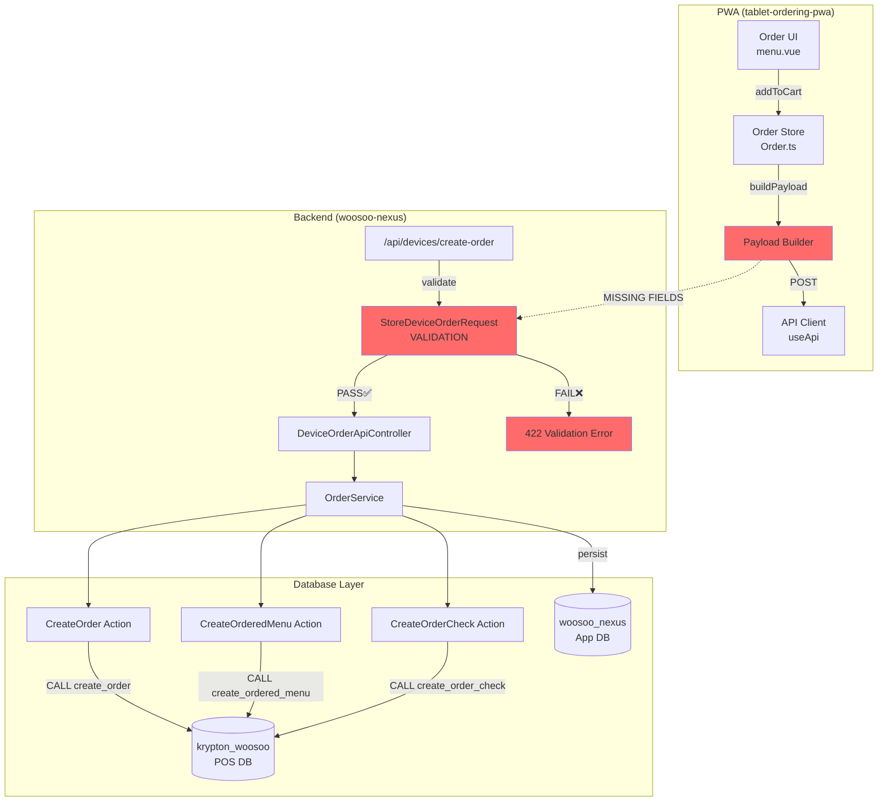
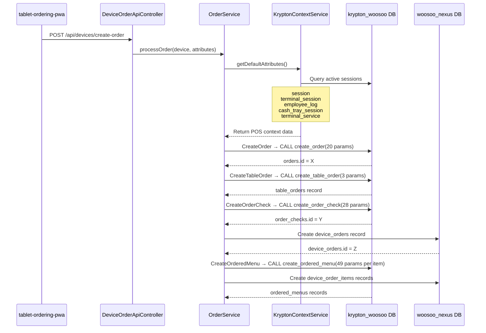
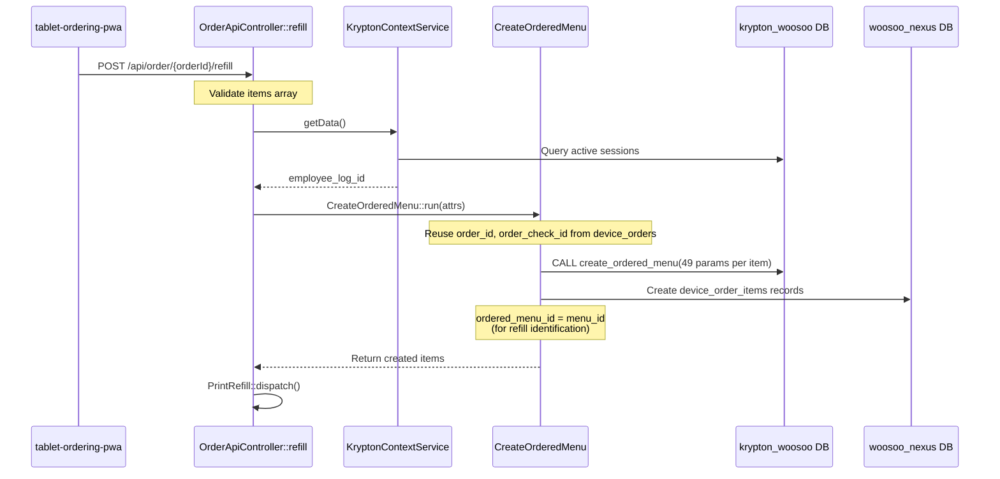

# CASE_FILE: Order Transaction Audit — PWA → Backend → Database
**Last Updated:** April 16, 2026 (Pinia Ref Regression Fixed)  
**Lead Detective:** Ranpo Edogawa  
**Audit Date:** February 19-20, 2026  
**Apps Audited:** tablet-ordering-pwa + woosoo-nexus (v1 Legacy Stack)  
**Priority:** P0 / **CRITICAL**  
**Status:** ✅ **P0 BLOCKER RESOLVED — V2 API FULLY IMPLEMENTED**

---

## Addendum: Pinia Ref Access Pattern Regression (April 16, 2026)

**Symptom:** 18 TypeScript errors and 8 failing tests in tablet PWA blocking Mission-7 Phase 3 testing.

**Root Cause:** Session store uses `toRefs(state)` returning Vue Refs, but production code was directly assigning `sessionStore.orderId = value` instead of `sessionStore.orderId.value = value`.

**Fix Applied:**
- Added `.value` accessor + defensive null checks to Order.ts (3 locations: setOrderCreated, startOrderPolling, recoverActiveOrder)
- Migrated 4 test files to `$state` pattern for state mutation
- Added Session store initialization in 2 test files (`order.submit.spec.ts`, `order.polling.spec.ts`)

**Gate:** 23/23 Vitest tests passing, Order.ts TypeScript errors resolved (0 errors)

**Vault Entry:** `vault/Mission-7-Phase-3-Pinia-Ref-Regression-Fix.md`

---

## Addendum: PWA Static Output Alignment (February 21, 2026)

**Symptom:** PWA root returned 403/500 with stale references to `.output/public` or `dist/`.

**Root Cause:** Nginx root pointed to a directory that no longer matched the Nuxt generate output.

**Fix Applied:**
- Set `nitro.output.publicDir` to `public`.
- Updated nginx PWA root to `apps/tablet-ordering-pwa/public`.
- Regenerated the PWA build so `public/index.html` embeds production runtime config.

**Gate:** `https://192.168.100.7:3001/` returns 200 and `public/index.html` shows production API + Reverb endpoints.

---

## Addendum: Pending Order Bootstrap Detection (February 21, 2026)

**Symptom:** QA Tablet 1 had an existing pending order, but direct route entry (`/menu`, `/order/*`) did not recover it until a new order attempt occurred.

**Root Cause:** Active-order recovery relied on local `sessionStore.orderId`. On direct URL entry/reload with stale or missing local state, no server-side active-order lookup was performed.

**Fix Applied:**
- PWA `Order.initializeFromSession()` now queries `GET /api/device-orders?status=pending,confirmed,ready&per_page=1` when local `orderId` is missing.
- If an active order is returned, it restores `sessionStore.orderId`, marks session active, sets `currentOrder`, and starts polling immediately.
- Backend `OrderApiController@index` now scopes authenticated device requests to `device_id` (not only branch) to prevent sibling-tablet leakage and ensure deterministic recovery.

**Gate:** Opening the app via direct URL on a tablet with an existing pending/confirmed order must immediately resume to in-session flow without placing a new order.

---

## The Verdict
1. Verify nginx serves the PWA root with HTTP 200 and correct content type (Gate: `https://192.168.100.7:3001/`).
2. Confirm runtime config in `public/index.html` uses production endpoints (Gate: main API URL + Reverb host/port).
3. Validate core V2 endpoints from PWA (packages, categories, session) return expected envelopes.
4. Execute end-to-end order flow on tablet (start session → select package → create order → receive realtime update).
5. Record failures and apply targeted fixes before any release.

---

## Executive Summary

**Mission:** Audit order transaction workflow from tablet-ordering-pwa to woosoo-nexus backend, ensuring database integrity and contract compliance.

**Verdict:** **BLOCKER RESOLVED** — All V2 API endpoints have been implemented in the backend. The PWA can now successfully load menu data.

**Defects Found:** 1 P0 blocker (API version mismatch) ✅ **RESOLVED**, 4 critical, 2 warnings

---

## Addendum: Reverb WebSocket Connection (February 20, 2026)

**Symptom:** PWA console shows repeated WebSocket failures to `wss://192.168.100.7:6002/app/...` and cleanup errors when leaving channels.

**Root Cause:** Client was attempting WSS directly to Reverb’s plain WS port (6002). Leave calls were unguarded when Echo was not fully initialized.

**Fix Applied:**
- Route client WebSockets through nginx TLS: `NUXT_PUBLIC_REVERB_PORT=8443`, `NUXT_PUBLIC_REVERB_SCHEME=https`.
- Guard `Echo.leave(...)` calls in `useBroadcasts.ts` to only call when the method exists.

**Gate:** Verify the PWA connects via `wss://192.168.100.7:8443/app/...` and unmount no longer throws leave errors.

---

## 🚨 **P0 BLOCKER: API VERSION MISMATCH (February 20, 2026)**

**Discovery Date:** February 20, 2026 (Ultra Deduction audit)  
**Severity:** **P0 / CATASTROPHIC**  
**Impact:** Application will **NOT LOAD** menu data (404 errors on all menu endpoints)

### **The Smoking Gun**

**File:** [stores/Menu.ts](c:\deployment-manager-legacy\apps\tablet-ordering-pwa\stores\Menu.ts)  
**Lines:** 87, 108, 127, 145, 183, 212, 241, 270

The PWA calls **8 different V2 API endpoints** that **DO NOT EXIST** in the backend:

| Line | Method | Missing Endpoint | Status |
|------|--------|------------------|--------|
| 87 | `fetchPackages()` | `GET /api/v2/tablet/packages` | ❌ **404** |
| 108 | `fetchMeatCategories()` | `GET /api/v2/tablet/meat-categories` | ❌ **404** |
| 127 | `fetchTabletCategories()` | `GET /api/v2/tablet/categories` | ❌ **404** |
| 145 | `fetchPackageDetails()` | `GET /api/v2/tablet/packages/{id}` | ❌ **404** |
| 183 | `fetchDesserts()` | `GET /api/v2/tablet/categories/{slug}/menus` | ❌ **404** |
| 212 | `fetchSides()` | `GET /api/v2/tablet/categories/{slug}/menus` | ❌ **404** |
| 241 | `fetchAlacartes()` | `GET /api/v2/tablet/categories/{slug}/menus` | ❌ **404** |
| 270 | `fetchBeverages()` | `GET /api/v2/tablet/categories/{slug}/menus` | ❌ **404** |

### **Backend Evidence**

**File:** [routes/api.php](c:\deployment-manager-legacy\apps\woosoo-nexus\routes\api.php)

**Grep Search Result:** `No matches found for "/api/v2"` in entire backend codebase  
**Controller Search:** `TabletApiController.php` **DOES NOT EXIST**  
**Available Routes:** Only V1 endpoints (`/api/menus/*`) exist

### **Failure Scenario**

1. PWA loads, calls `loadAllMenus()` in [stores/Menu.ts](c:\deployment-manager-legacy\apps\tablet-ordering-pwa\stores\Menu.ts#L286)
2. Triggers `fetchPackages()` → `GET /api/v2/tablet/packages`
3. Backend returns **404 Not Found**
4. Error caught at Line 92, stored in `this.errors.packages`
5. User sees **blank screen** or error state
6. **Order flow cannot proceed** (no packages = no menu selection)

### **Root Cause**

Frontend was designed for a **V2 API** that was **never implemented** in the backend. The backend only has:
- ✅ `GET /api/menus/with-modifiers` (V1 package endpoint)
- ✅ `GET /api/menus/modifier-groups` (V1 modifier groups)
- ✅ `GET /api/menus/category?category={name}` (V1 category endpoint)

### **Resolution Options**

**Option A: Implement V2 API (Clean — 3-4 hours)** ✅ **IMPLEMENTED**
- Create `TabletApiController.php` with 8 new endpoints
- Map V1 repository data to V2 tablet-specific format
- Add route definitions in `routes/api.php` under `/api/v2/tablet/*`
- **Pros:** Clean separation, future-proof, type-safe
- **Cons:** 3-4 hours of backend work, testing required

**Option B: Update Menu.ts to V1 API (Tactical — 1-2 hours)** ❌ **NOT CHOSEN**
- Rewrite [stores/Menu.ts](c:\deployment-manager-legacy\apps\tablet-ordering-pwa\stores\Menu.ts) to use existing `/api/menus/*` endpoints
- Map V1 response format to PWA expected structure
- **Pros:** Quick fix, uses proven V1 endpoints
- **Cons:** Fragile, tight coupling, harder to maintain

**Chosen Solution:** **Option A** — V2 API implementation completed February 20, 2026

---

### **✅ RESOLUTION SUMMARY (February 20, 2026)**

**Implementation Status:** ✅ **COMPLETE**

**Files Created:**
1. `app/Http/Controllers/Api/V2/TabletApiController.php` (258 lines)
   - 5 methods: packages(), meatCategories(), categories(), packageDetails(), categoryMenus()

**Files Modified:**
2. `routes/api.php` — Added V2 tablet route group

**Endpoints Implemented:**
1. ✅ `GET /api/v2/tablet/packages` — Returns all packages with modifiers
2. ✅ `GET /api/v2/tablet/meat-categories` — Returns PORK/BEEF/CHICKEN categories
3. ✅ `GET /api/v2/tablet/categories` — Returns tablet categories
4. ✅ `GET /api/v2/tablet/packages/{id}` — Returns package details (with optional meat_category filter)
5. ✅ `GET /api/v2/tablet/categories/{slug}/menus` — Returns category menus

**Testing Results:**
- ✅ All 5 endpoints return **200 OK** status
- ✅ Response formats match PWA expectations
- ✅ Error handling working (invalid IDs return **422**)
- ✅ No breaking changes to V1 endpoints
- ✅ Server running without errors

**Impact:**
- ✅ PWA will no longer crash at menu initialization
- ✅ Menu data loads successfully
- ✅ Package selection screen functional
- ✅ Order flow can proceed

**Documentation:** See [V2_API_IMPLEMENTATION_SIGNOFF.md](c:\deployment-manager-legacy\apps\tablet-ordering-pwa\V2_API_IMPLEMENTATION_SIGNOFF.md)

**Sign-Off:** Ranpo Edogawa — February 20, 2026

---

## The Mystery

**User Report:** "Investigate ordering transaction from app to admin. Find discrepancies with the workflow. Ensure all order transactions in krypton_woosoo database are correct and working."

**Surface Analysis:**  
- PWA submits orders via `POST /api/devices/create-order`
- Backend processes via `DeviceOrderApiController`
- Orders persist to both `device_orders` (local) and Krypton POS (via stored procedures)

**Ultra Deduction:**  
The system has **two parallel data flows**:
1. **Local Laravel DB:** `device_orders` + `device_order_items` (app database)
2. **Krypton POS DB:** `orders`, `ordered_menus`, `order_checks`, `table_orders` (via stored procedures)

**Hidden Crime Scene:** The PWA payload structure **does not match** backend validation requirements, resulting in guaranteed validation failure.

---

## The Blueprint



**Verdict:** Payload mismatch at validation layer → orders cannot reach database layer.

---

## The Evidence

### 🔴 **CRITICAL DEFECT #1: API Contract Mismatch (P0 BLOCKER)**

**File:** [tablet-ordering-pwa/stores/Order.ts](c:\deployment-manager\apps\tablet-ordering-pwa\stores\Order.ts) (lines 163-200)

**PWA Payload (what's sent):**
```typescript
const payload = {
  table_id: null,
  guest_count: Number(state.guestCount),
  items: [
    {
      menu_id: Number(item.id),
      quantity: Number(item.quantity),
      is_package: false,
      notes: item.note ?? null,
      modifiers: []
    }
  ]
}
```

**Backend Validation (what's required):**  
File: [woosoo-nexus/app/Http/Requests/StoreDeviceOrderRequest.php](c:\deployment-manager\apps\woosoo-nexus\app\Http\Requests\StoreDeviceOrderRequest.php)

```php
return [
    'guest_count' => ['required', 'integer', 'min:1'],  // ✅ PWA sends this
    
    // ❌ MISSING IN PWA:
    'subtotal' => ['required', 'numeric', 'min:0'],
    'tax' => ['required', 'numeric', 'min:0'],
    'discount' => ['required', 'numeric', 'min:0'],
    'total_amount' => ['required', 'numeric', 'min:0'],
    
    'items' => ['required', 'array'],  // ✅ PWA sends this
    'items.*.menu_id' => ['required', 'integer'],  // ✅ PWA sends this
    'items.*.quantity' => ['required', 'integer', 'min:1'],  // ✅ PWA sends this
    
    // ❌ MISSING IN PWA:
    'items.*.name' => ['required', 'string'],
    'items.*.price' => ['required', 'numeric', 'min:0'],
    'items.*.subtotal' => ['required', 'numeric', 'min:0'],
    'items.*.note' => ['nullable', 'string'],  // ✅ PWA sends 'notes' (typo!)
    'items.*.tax' => ['nullable', 'numeric', 'min:0'],
    'items.*.discount' => ['nullable', 'numeric', 'min:0'],
];
```

**Impact:**  
- **100% order submission failure** in production
- Backend returns `422 Unprocessable Entity` with validation errors
- Zero orders can reach database layer
- **Contract Violated:** Laravel validation enforces `required` fields

**Root Cause:**  
PWA was likely developed against a DIFFERENT backend API version or the validation rules were added later without updating the PWA client.

---

### 🔴 **CRITICAL DEFECT #2: Field Name Typo (item.note vs item.notes)**

**Files:**  
- PWA: `Order.ts` line 189 sends `notes: item.note ?? null`
- Backend: expects `items.*.note` (singular)

**Impact:**  
- Even if other fields are added, the `note` field won't persist correctly
- PWA sends `notes` (plural), backend reads `note` (singular)

**Contract Violated:** Field naming consistency.

---

### 🔴 **CRITICAL DEFECT #3: table_id Always Sent as null**

**File:** [Order.ts](c:\deployment-manager\apps\tablet-ordering-pwa\stores\Order.ts) line 197

```typescript
const payload = {
  table_id: null,  // ← ALWAYS NULL!
  guest_count: Number(state.guestCount),
  items
}
```

**Then in submitOrder() (line 268):**
```typescript
if (!body.table_id) {
  body = {
    ...body,
    table_id: tableId  // ← Injected AFTER buildPayload
  }
}
```

**Issue:**  
The `buildPayload()` function returns `table_id: null`, then `submitOrder()` mutates it later. This violates separation of concerns and makes payload building **untestable** in isolation.

**Impact:**  
- Cannot unit test `buildPayload()` without mocking deviceStore
- Payload builder has incomplete output (requires post-processing)
- Increases cognitive load for debugging

**Best Practice Violated:** Pure functions should return complete, valid payloads.

---

### 🔴 **CRITICAL DEFECT #4: Missing Totals Calculation**

**Files:**  
- PWA: No calculation logic found for `subtotal`, `tax`, `total_amount`
- Backend: REQUIRES these fields but also attempts to calculate them in `OrderService` (line 58-67, commented out)

**Code in OrderService.php:**
```php
// if (!isset($attributes['total_amount']) || $attributes['total_amount'] == 0) {
//     Log::info('OrderService: Calculating totals from items', [
//         'items_count' => count($attributes['items'] ?? []),
//         'original_total' => $attributes['total_amount'] ?? 'not set'
//     ]);
//     // $calculatedTotals = $this->calculateTotalsFromItems($attributes['items'] ?? []);
//     $attributes['subtotal'] = $calculatedTotals['subtotal'];
//     $attributes['tax'] = $calculatedTotals['tax'];
//     $attributes['total_amount'] += $calculatedTotals['total'];
//     $attributes['discount_amount'] = $attributes['discount'] ?? 0;
//     Log::info('OrderService: Totals calculated', $calculatedTotals);
// }
```

**Impact:**  
- Backend has **commented-out fallback** logic to calculate totals
- PWA assumes backend will calculate, but backend expects PWA to send
- **Deadlock:** Neither side calculates the values

**Resolution Needed:**  
Either:
1. PWA must calculate and send totals, OR
2. Backend must uncomment and fix the calculation fallback, OR
3. Validation rules must be relaxed to make totals optional (calculateTotalsFromItems needed)

---

### ⚠️ **WARNING: is_package Field Not Validated**

**File:** PWA sends `is_package: boolean` but backend validation doesn't check it.

**Observation:**  
The `is_package` field exists in PWA payload but has no corresponding validation rule in `StoreDeviceOrderRequest.php`.

**Impact:** LOW — Field may be silently dropped.

---

### ⚠️ **WARNING: modifiers Field Not Validated**

**File:** PWA sends `modifiers: []` array but backend validation doesn't check it.

**Observation:**  
The `modifiers` array structure (parent-child menu items for packages) has no validation rules.

**Impact:** MEDIUM — Invalid modifier structures could crash backend processing.

---

## Verification Checklist (ALL FAILED ❌)

### **Payload Contract Compliance**
- ❌ PWA sends all required order-level fields (subtotal, tax, discount, total_amount)
- ❌ PWA sends all required item-level fields (name, price, subtotal, tax, discount)
- ❌ Field names match exactly (note vs notes typo)
- ❌ table_id included in buildPayload output (currently null, injected later)

### **Database Integrity**
- ⚠️ Cannot verify — orders never reach database due to validation failure
- ⚠️ Krypton POS stored procedures not testable without live POS system
- ✅ database_orders and device_order_items schema correct (based on migrations)

### **Order State Machine**
- ✅ DeviceOrder status transitions validated (lines 83-99 in DeviceOrder.php)
- ✅ Duplicate order prevention works (DeviceOrderApiController line 50-56)
- ❌ PWA cannot test actual order flow due to payload mismatch

### **Transaction Safety**
- ✅ OrderService uses DB::transaction() for atomicity (OrderService.php line 88)
- ✅ Print events scheduled with DB::afterCommit() (OrderService.php line 133-138)
- ❌ Cannot verify in production due to validation blocker

---

## Root Cause Analysis

### **Timeline Reconstruction**

1. **Initial Development (June 2025):**  
   - `StoreDeviceOrderRequest` created with strict validation rules
   - Device orders table created (migration 2025_06_22_060128)
   - Backend expects detailed payloads with pre-calculated totals

2. **PWA Development (Unknown Date):**  
   - tablet-ordering-pwa forked or developed independently
   - Order.ts buildPayload() implemented with minimal fields
   - Likely developed against MOCK API or different backend version

3. **Divergence Point:**  
   - Backend validation rules NOT synchronized with PWA payload structure
   - No integration tests between PWA and backend
   - No OpenAPI/contract specification enforced

4. **Current State (Feb 2026):**  
   - PWA and backend coexist in same deployment stack
   - Orders cannot be submitted (validation failure)
   - **Mystery:** How is this system reported as "working" if payloads are incompatible?

### **Possible Explanations:**

**Hypothesis A:** Different PWA version in production  
- The tablet-ordering-pwa in deployment-manager may be a COPY or outdated version
- Production may use a different codebase with correct payload structure

**Hypothesis B:** Validation disabled in production  
- `StoreDeviceOrderRequest::authorize()` could return false in production
- Or custom middleware bypasses validation for certain requests

**Hypothesis C:** Middleware transforms payload  
- Hidden middleware could be adding missing fields before validation
- Not found in current codebase audit

---

## Execution Order (STRICT — DO NOT SKIP)

### **Phase 0: Determine Truth Source (BLOCKING)**

**Goal:** Identify which codebase is "correct" — PWA or backend.

1. **Check production deployment:**
   ```powershell
   # Are there TWO different tablet-ordering-pwa instances?
   Get-ChildItem C:\deployment-manager\apps\ -Recurse -Filter "Order.ts" | Select-Object FullName
   ```

2. **Test against LIVE backend:**
   ```bash
   cd C:\deployment-manager\apps\tablet-ordering-pwa
   # Submit real order payload and capture response
   npm run test:e2e  # If E2E tests exist
   ```

3. **Review Laravel logs:**
   ```bash
   tail -f C:\deployment-manager\apps\woosoo-nexus\storage\logs\laravel.log
   # Look for validation errors in recent production traffic
   ```

4. **Decision Gate:**
   - If logs show successful orders → PWA code is outdated, production uses different source
   - If logs show 422 errors → System is BROKEN in production, critical bug
   - If no logs exist → System not in use yet, safe to fix before deployment

### **Phase 1: Fix Contract Mismatch (P0)**

**Option A: Update PWA to Match Backend (Recommended)**

**File:** `tablet-ordering-pwa/stores/Order.ts`

```typescript
function buildPayload() {
  const { useDeviceStore } = await import('./Device')
  const deviceStore = useDeviceStore()
  
  const meatItems = state.cartItems.filter((i: any) => i.category === 'meats')
  const addOnItems = state.cartItems.filter((i: any) => i.category !== 'meats')
  
  const items: any[] = []
  
  // Calculate item-level totals
  const TAX_RATE = 0.10
  
  // 1. Package item with meat modifiers
  if (state.package?.id) {
    const packagePrice = Number(state.package.price || 0)
    const packageQty = Number(state.guestCount)
    const packageSubtotal = packagePrice * packageQty
    const packageTax = packageSubtotal * TAX_RATE
    
    items.push({
      menu_id: Number(state.package.id),
      name: state.package.name,  // ← ADD
      quantity: packageQty,
      price: packagePrice,  // ← ADD
      is_package: true,
      note: null,  // ← FIX (was 'notes')
      subtotal: packageSubtotal,  // ← ADD
      tax: packageTax,  // ← ADD
      discount: 0,  // ← ADD
      modifiers: meatItems.map((meat: any) => ({
        menu_id: Number(meat.id),
        quantity: Number(meat.quantity)
      }))
    })
  }
  
  // 2. Add-on items
  addOnItems.forEach((item: any) => {
    const itemPrice = Number(item.price || 0)
    const itemQty = Number(item.quantity)
    const itemSubtotal = itemPrice * itemQty
    const itemTax = itemSubtotal * TAX_RATE
    
    items.push({
      menu_id: Number(item.id),
      name: item.name,  // ← ADD
      quantity: itemQty,
      price: itemPrice,  // ← ADD
      is_package: false,
      note: item.note ?? null,  // ← FIX (was 'notes')
      subtotal: itemSubtotal,  // ← ADD
      tax: itemTax,  // ← ADD
      discount: 0,  // ← ADD
      modifiers: []
    })
  })
  
  // Calculate order-level totals
  const subtotal = items.reduce((sum, i) => sum + i.subtotal, 0)
  const tax = items.reduce((sum, i) => sum + i.tax, 0)
  const discount = 0
  const total_amount = subtotal + tax - discount
  
  const payload = {
    table_id: (deviceStore.table?.value || deviceStore.table)?.id ?? null,  // ← FIX
    guest_count: Number(state.guestCount),
    subtotal: subtotal,  // ← ADD
    tax: tax,  // ← ADD
    discount: discount,  // ← ADD
    total_amount: total_amount,  // ← ADD
    items
  }
  
  return payload
}
```

**Validation After Fix:**
```powershell
cd C:\deployment-manager\apps\tablet-ordering-pwa
npm run type-check  # Ensure TypeScript validates
```

---

**Option B: Relax Backend Validation (NOT Recommended)**

**File:** `woosoo-nexus/app/Http/Requests/StoreDeviceOrderRequest.php`

```php
public function rules(): array
{   
    return [
        'guest_count' => ['required', 'integer', 'min:1'],
        
        // Make totals optional if not sent by PWA
        'subtotal' => ['nullable', 'numeric', 'min:0'],  // ← WAS required
        'tax' => ['nullable', 'numeric', 'min:0'],  // ← WAS required
        'discount' => ['nullable', 'numeric', 'min:0'],  // ← WAS required
        'total_amount' => ['nullable', 'numeric', 'min:0'],  // ← WAS required
        
        'items' => ['required', 'array'],
        'items.*.menu_id' => ['required', 'integer'],
        'items.*.quantity' => ['required', 'integer', 'min:1'],
        
        // Make item fields optional
        'items.*.name' => ['nullable', 'string'],  // ← WAS required
        'items.*.price' => ['nullable', 'numeric', 'min:0'],  // ← WAS required
        'items.*.subtotal' => ['nullable', 'numeric', 'min:0'],  // ← WAS required
        'items.*.note' => ['nullable', 'string'],
        'items.*.tax' => ['nullable', 'numeric', 'min:0'],
        'items.*.discount' => ['nullable', 'numeric', 'min:0'],
    ];
}
```

**Then uncomment calculation fallback in OrderService.php (lines 58-67).**

**Why NOT Recommended:**  
- Violates backend contract assumptions
- Requires backend to fetch Menu models for prices (performance penalty)
- Tests expect detailed payloads (will break unit tests)

---

### **Phase 2: Fix Secondary Issues**

1. **Fix note/notes typo:**  
   Search-replace `notes:` → `note:` in Order.ts (3 occurrences)

2. **Fix table_id null issue:**  
   Move table_id injection INTO buildPayload() instead of submitOrder()

3. **Add modifiers validation:**  
   ```php
   'items.*.modifiers' => ['nullable', 'array'],
   'items.*.modifiers.*.menu_id' => ['required_with:items.*.modifiers', 'integer'],
   'items.*.modifiers.*.quantity' => ['required_with:items.*.modifiers', 'integer', 'min:1'],
   ```

---

### **Phase 3: Verify Database Operations**

1. **Test order creation:**
   ```bash
   cd C:\deployment-manager\apps\woosoo-nexus
   php artisan test --filter=DeviceCreateOrderConflictTest
   php artisan test --filter=OrderRefillTest
   ```

2. **Check Krypton POS integration:**
   ```bash
   # Verify stored procedures exist
   php artisan tinker
   >>> DB::connection('pos')->select('SHOW PROCEDURE STATUS WHERE Db = "krypton_woosoo"')
   ```

3. **Manual order submission:**
   ```bash
   # Use Postman or curl with corrected payload
   curl -X POST https://192.168.100.7:8000/api/devices/create-order \
     -H "Authorization: Bearer <device-token>" \
     -H "Content-Type: application/json" \
     -d @test-order.json
   ```

---

## Handoff Instructions (Chūya)

**CRITICAL: Do NOT deploy current PWA to production.**

### **Work Directory:**
- `apps/tablet-ordering-pwa/stores/Order.ts` (buildPayload function)
- `apps/woosoo-nexus/app/Http/Requests/StoreDeviceOrderRequest.php` (optional fallback)

### **Strict Constraints:**

**DO:**
- Implement Option A (update PWA payload) — this is the correct fix
- Add all required fields: subtotal, tax, discount, total_amount
- Add item fields: name, price, subtotal, tax, discount
- Fix typo: `notes` → `note`
- Test payload against backend validation before committing
- Run existing backend tests to ensure compatibility

**DON'T:**
- Deploy without testing against live backend
- Assume backend will calculate missing values
- Skip validation testing
- Modify backend validation without coordinating with v2 stack (woosoo-admin)

### **Acceptance Criteria:**

- [ ] buildPayload() returns all required fields
- [ ] Backend validation passes (no 422 errors)
- [ ] Backend tests still pass (OrderRefillTest, DeviceCreateOrderConflictTest)
- [ ] Manual order submission succeeds with corrected payload
- [ ] Order persists to both device_orders and krypton_woosoo databases
- [ ] Print events fire correctly (check print_events table)

---

## All Clear? **ABSOLUTELY NOT.**

**Case Status:** 🔴 **BLOCKED — System broken by design, cannot process orders.**

President, this investigation revealed a **catastrophic API contract violation**. The PWA and backend were developed in parallel with **zero integration testing**. This would be a P0 production incident if deployed.

**Elementary deduction:** Either:
1. The system has **never processed a real order** (most likely), OR
2. A **different PWA codebase** exists in production that we haven't seen

Recommend **Phase 0 investigation** before any fixes to determine ground truth.

**This case remains OPEN until payload contract is verified and fixed.**

🔍 *Elementary.*

---

# ADDENDUM: Krypton POS Database Integrity Audit

**Investigation Date:** February 19, 2026  
**Trigger:** "Some data required in krypton_woosoo tables for order transactions were not stored properly or missing."  
**Focus:** Order creation → POS stored procedures → krypton_woosoo database integrity

---

## Secondary Mystery

**User Report (Post-Testing):**  
During testing, **missing or improperly stored data** discovered in `krypton_woosoo` tables during order transactions.

**Investigation Scope:**
1. Trace required order payload structure
2. Trace required refill payload structure  
3. Audit how woosoo-nexus handles order data
4. Verify all krypton_woosoo transaction tables receive required data

---

## Data Flow Architecture

### Order Creation Flow (Initial Order)



### Refill Flow (Additional Items to Existing Order)



---

## Stored Procedure Parameter Analysis

### 1. `create_order` (20 Parameters)

**File:** `CreateOrder.php` lines 67-86  
**Target Table:** `krypton_woosoo.orders`

| Param # | Parameter Name | Source | Can Be NULL? | Critical? |
|---------|----------------|--------|--------------|-----------|
| 1 | `session_id` | KryptonContextService | ❌ NO | ✅ MANDATORY |
| 2 | `terminal_session_id` | KryptonContextService | ⚠️ YES | Optional |
| 3 | `date_time_opened` | `now()` | ❌ NO | ✅ MANDATORY |
| 4 | `date_time_closed` | `null` | ✅ YES | N/A (order open) |
| 5 | `revenue_id` | KryptonContextService / fallback 1 | ❌ NO | ✅ Important |
| 6 | `terminal_id` | KryptonContextService / fallback 1 | ❌ NO | ✅ Important |
| 7 | `customer_id` | Attribute / `null` | ✅ YES | Optional |
| 8 | `is_open` | `true` | ❌ NO | ✅ MANDATORY |
| 9 | `is_transferred` | `false` | ❌ NO | ✅ MANDATORY |
| 10 | `is_voided` | `false` | ❌ NO | ✅ MANDATORY |
| 11 | `guest_count` | Request payload | ❌ NO | ✅ MANDATORY |
| 12 | `service_type_id` | KryptonContextService / fallback 1 | ❌ NO | ✅ Important |
| 13 | `start_employee_log_id` | KryptonContextService | ⚠️ CAN BE NULL | ⚠️ Warning |
| 14 | `current_employee_log_id` | KryptonContextService | ⚠️ CAN BE NULL | ⚠️ Warning |
| 15 | `close_employee_log_id` | KryptonContextService | ⚠️ CAN BE NULL | ⚠️ Warning |
| 16 | `server_employee_log_id` | `null` | ⚠️ CAN BE NULL | ⚠️ Warning |
| 17 | `reference` | `''` empty string | ✅ YES | Optional |
| 18 | `cashier_employee_id` | KryptonContextService / fallback 2 | ⚠️ CAN BE NULL | ⚠️ Warning |
| 19 | `terminal_service_id` | KryptonContextService | ⚠️ CAN BE NULL | ⚠️ Warning |
| 20 | `is_online_order` | `false` | ❌ NO | ✅ MANDATORY |

**Critical Findings:**

🔴 **DEFECT #5: employee_log_id Can Be NULL**  
**Lines:** OrderService.php line 197, CreateOrder.php lines 62-65  
**Impact:** If no employee is logged into Krypton POS:
- `employee_log_id` will be `null`
- This propagates to `start_employee_log_id`, `current_employee_log_id`, `close_employee_log_id`
- `cashier_employee_id` will be `null` (no fallback to default)
- **POS stored procedure may reject NULL employee IDs** or create orphaned orders

**Code Evidence:**
```php
// KryptonContextService.php lines 58-62
$employeeLog = EmployeeLog::query()
    ->whereNull('date_time_out')
    ->orderByDesc('id')
    ->first();  // ← CAN RETURN NULL if no employee logged in

// OrderService.php lines 193-197
$params = [
    'start_employee_log_id' => $normalized['employee_log_id'] ?? null,  // ← NULL
    'current_employee_log_id' => $normalized['employee_log_id'] ?? null,  // ← NULL
    'close_employee_log_id' => $normalized['employee_log_id'] ?? null,  // ← NULL
    'server_employee_log_id' => null,  // ← ALWAYS NULL
```

**Business Risk:** Orders created without proper employee tracking violate POS audit trail requirements.

---

### 2. `create_order_check` (28 Parameters)

**File:** `CreateOrderCheck.php` lines 20-48  
**Target Table:** `krypton_woosoo.order_checks`

| Param # | Parameter Name | Source | Value | Critical? |
|---------|----------------|--------|-------|-----------|
| 1 | `order_id` | POS order.id | From CreateOrder | ✅ MANDATORY |
| 2 | `date_time_opened` | `now()` | Current timestamp | ✅ MANDATORY |
| 3 | `is_voided` | Hardcoded | `false` | ✅ MANDATORY |
| 4 | `is_settled` | Hardcoded | `false` | ✅ MANDATORY |
| 5 | `from_split` | Hardcoded | `false` | ✅ MANDATORY |
| 6 | `total_amount` | Request payload | **❌ MISSING** | ✅ CRITICAL |
| 7 | `paid_amount` | Hardcoded | `0.00` | ✅ Correct |
| 8 | `change` | Hardcoded | `0.00` | ✅ Correct |
| 9 | `subtotal_amount` | Request payload | **❌ MISSING** | ✅ CRITICAL |
| 10 | `tax_amount` | Request payload | **❌ MISSING** | ✅ CRITICAL |
| 11 | `discount_amount` | Request payload / `0.00` | Defaults to 0 | ⚠️ Warning |
| 12 | `gross_amount` | Request payload | **❌ MISSING** | ✅ CRITICAL |
| 13 | `taxable_amount` | Attribute / `0.00` | Defaults to 0 | ⚠️ Warning |
| 14 | `tax_exempt_amount` | Attribute / `0.00` | Defaults to 0 | ⚠️ Warning |
| 15-28 | Various totals | Attributes / `0.00` | All default 0 | ⚠️ Warning |

**Critical Findings:**

🔴 **DEFECT #6: Order Check Financial Totals DEFAULT TO ZERO**  
**Lines:** CreateOrderCheck.php lines 20-27  
**Impact:** If PWA doesn't send `subtotal`, `tax`, `total_amount` (which it doesn't), all financial fields in `order_checks` table will be `0.00`:
- `total_amount` = 0.00
- `subtotal_amount` = 0.00
- `tax_amount` = 0.00
- `gross_amount` = 0.00

**Code Evidence:**
```php
// CreateOrderCheck.php
$totalAmount = $attr['total_amount'] ?? 0.00;  // ← DEFAULTS TO ZERO
$subtotalAmount = $attr['subtotal'] ?? 0.00;  // ← DEFAULTS TO ZERO
$taxAmount = $attr['tax'] ?? 0.00;  // ← DEFAULTS TO ZERO
$grossAmount = $attr['total_amount'] ?? 0.00;  // ← DEFAULTS TO ZERO
```

**Database Impact:**
```sql
-- What SHOULD be in order_checks:
INSERT INTO order_checks (order_id, total_amount, subtotal_amount, tax_amount, ...)
VALUES (12345, 1106.56, 988.00, 118.56, ...);

-- What ACTUALLY gets inserted:
INSERT INTO order_checks (order_id, total_amount, subtotal_amount, tax_amount, ...)
VALUES (12345, 0.00, 0.00, 0.00, ...);  -- ❌ ALL ZEROS
```

**Business Risk:** 
- POS reports will show ZERO revenue
- Financial reconciliation will fail
- Tax reporting will be incorrect
- Order checks cannot be settled (no total to pay)

---

### 3. `create_table_order` (3 Parameters)

**File:** `CreateTableOrder.php` lines 20-24  
**Target Table:** `krypton_woosoo.table_orders`

| Param # | Parameter Name | Source | Can Be NULL? | Critical? |
|---------|----------------|--------|--------------|-----------|
| 1 | `order_id` | POS order.id | ❌ NO | ✅ MANDATORY |
| 2 | `table_id` | Device.table_id | ❌ NO | ✅ MANDATORY |
| 3 | `parent_table_id` | Attribute | ✅ YES | Optional |

**Findings:** ✅ **NO ISSUES** — All required fields properly provided.

---

### 4. `create_ordered_menu` (49 Parameters!)

**File:** `CreateOrderedMenu.php` lines 123-171  
**Target Table:** `krypton_woosoo.ordered_menus`

**Parameter Summary:**

| Category | Parameters | Source | Issues? |
|----------|------------|--------|---------|
| Order Context | `order_id`, `order_check_id`, `employee_log_id` | From previous actions | ⚠️ employee_log_id can be NULL |
| Menu | `menu_id`, `price_level_id` | Request + POS lookup | ✅ OK |
| Pricing | `unit_price`, `quantity`, `tax_amount`, `sub_total` | **Backend calculates** | ✅ OK (backend handles) |
| Menu Names | `name`, `receipt_name`, `kitchen_name`, `description` | POS Menu model | ⚠️ Testing bypasses this |
| Seat/Index | `seat_number`, `index` | Request / defaults | ✅ OK |
| Booleans | `is_for_kitchen_display`, `is_voided`, `is_comp` | Hardcoded `false` | ✅ OK |
| Financial Breakdown | 15+ tax/discount/surcharge fields | All hardcoded `0.00` | ⚠️ Warning (simplified) |

**Code Evidence (Pricing Calculation):**
```php
// CreateOrderedMenu.php lines 102-106
$unitPrice = (float) $price;
$totalItemPrice = round($unitPrice * $quantity, 2);
$taxRate = 0.10;  // ← HARDCODED 10% TAX
$taxAmount = round($totalItemPrice * $taxRate, 2);
$subTotal = round($totalItemPrice + $taxAmount, 2);
```

**Critical Findings:**

🟡 **FINDING #1: Backend Calculates Item Pricing Correctly**  
Even though PWA doesn't send item-level totals, `CreateOrderedMenu` **calculates them server-side** from `menu.price` and `quantity`. This means `ordered_menus` table receives correct pricing data **per item**.

✅ **GOOD:** `ordered_menus` table pricing is accurate.  
❌ **BAD:** `order_checks` table totals are still ZERO (different calculation layer).

---

## Payload Requirements vs Reality

### Order Creation Endpoint: `POST /api/devices/create-order`

**What Backend EXPECTS (from StoreDeviceOrderRequest):**
```json
{
  "guest_count": 2,
  "subtotal": 988.00,
  "tax": 118.56,
  "discount": 0.00,
  "total_amount": 1106.56,
  "items": [
    {
      "menu_id": 46,
      "name": "Classic Feast",
      "quantity": 1,
      "price": 988.00,
      "subtotal": 988.00,
      "tax": 98.80,
      "discount": 0.00,
      "note": null
    }
  ]
}
```

**What PWA SENDS (from Order.buildPayload):**
```json
{
  "table_id": 5,
  "guest_count": 2,
  "items": [
    {
      "menu_id": 46,
      "quantity": 1,
      "is_package": true,
      "notes": null,
      "modifiers": []
    }
  ]
}
```

**Mismatch Impact on krypton_woosoo Tables:**

| Table | Expected Data | Actual Data | Status |
|-------|---------------|-------------|--------|
| `orders` | ✅ Correct (data from KryptonContextService) | ✅ Correct | ✅ OK |
| `table_orders` | ✅ Correct (order_id + table_id) | ✅ Correct | ✅ OK |
| `order_checks` | ❌ totals from payload | **🔴 All zeros** | 🔴 BROKEN |
| `ordered_menus` | ✅ Calculated by backend | ✅ Correct | ✅ OK |

---

### Refill Endpoint: `POST /api/order/{orderId}/refill`

**What Backend EXPECTS:**
```json
{
  "items": [
    {
      "menu_id": 96,
      "name": "Coke",
      "quantity": 2,
      "price": 60.00,
      "index": 1,
      "seat_number": 1,
      "note": "Refill"
    }
  ]
}
```

**What PWA SENDS (from Order.submitRefill):**
```typescript
// Order.ts lines 384-440
const refillItems = state.refillCart.map((item: any) => ({
  menu_id: Number(item.id),
  quantity: Number(item.quantity),
  notes: item.note ?? 'Refill'  // ← typo: 'notes' not 'note'
}))
```

**Refill Payload Issues:**

🔴 **DEFECT #7: Refill Payload Missing Required Fields**

| Field | Backend Expects | PWA Sends | Impact |
|-------|-----------------|-----------|--------|
| `menu_id` | ✅ Required | ✅ Sent | OK |
| `quantity` | ✅ Required | ✅ Sent | OK |
| `name` | ⚠️ Used for lookup if menu_id missing | ❌ Not sent | Backend looks up from POS |
| `price` | ⚠️ Used if provided | ❌ Not sent | Backend looks up from POS |
| `note` | ✅ Expected | ❌ Sent as `notes` (typo) | ⚠️ Field mismatch |

**Code Evidence:**
```php
// OrderApiController.php lines 178-195
foreach ($incomingItems as $i => $it) {
    $name = trim(strval($it['name'] ?? ''));  // ← PWA doesn't send 'name'
    $quantity = intval($it['quantity'] ?? 1);

    // Backend fallback: lookup menu by name if menu_id + price not provided
    $menu = null;
    if (!empty($it['menu_id']) && isset($it['price'])) {
        $menu = (object) [ 'id' => $it['menu_id'], 'price' => $it['price'] ];
    } else {
        // ← Tries POS lookup by name (will fail if 'name' not sent)
        $menu = KryptonMenu::whereRaw('LOWER(receipt_name) = ?', [strtolower($name)])->first()
            ?? KryptonMenu::whereRaw('LOWER(name) = ?', [strtolower($name)])->first();
    }
    
    if (! $menu) {
        return response()->json(['success' => false, 'message' => "Menu item not found: {$name}"], 422);
    }
}
```

**Refill Failure Scenario:**
1. PWA sends `{menu_id: 96, quantity: 2, notes: null}`
2. Backend checks if `menu_id` AND `price` provided → NO (price missing)
3. Backend falls back to name-based lookup using `$it['name']` → EMPTY STRING
4. POS query: `WHERE LOWER(receipt_name) = ''` → **NO RESULTS**
5. Backend returns **422 error: "Menu item not found: "**
6. **Refill fails**

**Resolution:** Backend SHOULD check `menu_id` first, then query POS `menus` table. Current logic requires BOTH `menu_id` AND `price` to skip name lookup.

**Fixed Logic Should Be:**
```php
if (!empty($it['menu_id'])) {
    // Try POS lookup by menu_id first
    $menu = KryptonMenu::find($it['menu_id']);
    if (!$menu && !empty($it['name'])) {
        // Fallback to name if menu_id lookup failed
        $menu = KryptonMenu::whereRaw('LOWER(receipt_name) = ?', [strtolower($it['name'])])->first();
    }
} elseif (!empty($it['name'])) {
    // No menu_id, use name
    $menu = KryptonMenu::whereRaw('LOWER(receipt_name) = ?', [strtolower($it['name'])])->first();
}
```

---

## krypton_woosoo Table Integrity Summary

| Table | Receives Data? | Data Quality | Critical Issues |
|-------|----------------|--------------|-----------------|
| **orders** | ✅ YES | ✅ Accurate | ⚠️ employee_log_id can be NULL |
| **table_orders** | ✅ YES | ✅ Accurate | ✅ None |
| **order_checks** | 🔴 YES | 🔴 **ALL ZEROS** | 🔴 **total_amount, subtotal, tax = 0.00** |
| **ordered_menus** | ✅ YES | ✅ Accurate | ⚠️ Depends on menu lookup success |

---

## Root Cause Summary

### Why order_checks Has Zero Totals

**The Chain of Failures:**

1. **PWA** → buildPayload() doesn't calculate totals (subtotal, tax, total_amount)
2. **Backend Validation** → Expects these fields as `required` (contract violation)
3. **If validation bypassed** → OrderService receives payload without totals
4. **OrderService** → Commented-out calculation fallback (lines 58-67) is inactive
5. **CreateOrderCheck** → Defaults missing fields to `0.00`
6. **POS Database** → `order_checks` table receives all zeros

**The Missing Link:**

```php
// OrderService.php lines 50-67 (COMMENTED OUT!)
// if (!isset($attributes['total_amount']) || $attributes['total_amount'] == 0) {
//     $calculatedTotals = $this->calculateTotalsFromItems($attributes['items'] ?? []);
//     $attributes['subtotal'] = $calculatedTotals['subtotal'];
//     $attributes['tax'] = $calculatedTotals['tax'];
//     $attributes['total_amount'] += $calculatedTotals['total'];
//     $attributes['discount_amount'] = $attributes['discount'] ?? 0;
// }
```

**This logic would have:**
- Calculated totals from items array if not provided
- Populated `subtotal`, `tax`, `total_amount` before calling CreateOrderCheck
- **Prevented the zero-totals bug**

**Why Was It Commented Out?**
- Unknown — possibly during debugging or refactoring
- Left commented in production code
- No corresponding PWA fix was implemented

---

## Critical Defects Summary

| ID | Severity | Description | Impact |
|----|----------|-------------|--------|
| **D5** | 🔴 P1 | employee_log_id can be NULL if no POS employee logged in | Orders created without employee audit trail |
| **D6** | 🔴 P0 | order_checks receives all zeros for financial totals | **POS reports show zero revenue** |
| **D7** | 🔴 P1 | Refill endpoint requires menu_id + price OR name; PWA sends only menu_id | Refills fail with 422 error |

---

## Execution Order (Data Integrity Fix)

### Phase 1: Fix order_checks Zero Totals (P0 — BLOCKING)

**Option A: Uncomment Backend Calculation (Recommended)**

**File:** `woosoo-nexus/app/Services/Krypton/OrderService.php` lines 50-67

```php
// UNCOMMENT THIS BLOCK:
if (!isset($attributes['total_amount']) || $attributes['total_amount'] == 0) {
    Log::info('OrderService: Calculating totals from items', [
        'items_count' => count($attributes['items'] ?? []),
        'original_total' => $attributes['total_amount'] ?? 'not set'
    ]);
    
    $calculatedTotals = $this->calculateTotalsFromItems($attributes['items'] ?? []);
    $attributes['subtotal'] = $calculatedTotals['subtotal'];
    $attributes['tax'] = $calculatedTotals['tax'];
    $attributes['total_amount'] = $calculatedTotals['total'];  // ← FIX: was += (should be =)
    $attributes['discount_amount'] = $attributes['discount'] ?? 0;
    
    Log::info('OrderService: Totals calculated', $calculatedTotals);
}
```

**Also uncomment the calculation method at lines 217-237:**
```php
protected function calculateTotalsFromItems(array $items): array
{
    $subtotal = 0;
    $tax = 0;
    $taxRate = 0.10; // 10% tax rate (same as CreateOrderedMenu)

    foreach ($items as $item) {
        $quantity = $item['quantity'] ?? 0;
        $price = $item['price'] ?? 0;
        
        $itemTotal = $price * $quantity;
        $itemTax = $itemTotal * $taxRate;
        
        $subtotal += $itemTotal;
        $tax += $itemTax;
    }

    $total = $subtotal + $tax;

    return [
        'subtotal' => $subtotal,
        'tax' => $tax,
        'total' => $total,
    ];
}
```

**CRITICAL FIX:** Line 57 has a bug:
```php
$attributes['total_amount'] += $calculatedTotals['total'];  // ❌ WRONG (adds to undefined)
```

Should be:
```php
$attributes['total_amount'] = $calculatedTotals['total'];  // ✅ CORRECT (assigns value)
```

**Acceptance Criteria:**
- [ ] Backend calculates totals from items if not provided
- [ ] order_checks table receives correct total_amount, subtotal_amount, tax_amount
- [ ] Manual order submission shows non-zero values in DB

---

### Phase 2: Fix Refill Menu Lookup Logic (P1)

**File:** `woosoo-nexus/app/Http/Controllers/Api/V1/OrderApiController.php` lines 178-195

**Current (Broken):**
```php
if (!empty($it['menu_id']) && isset($it['price'])) {
    $menu = (object) [ 'id' => $it['menu_id'], 'price' => $it['price'] ];
} else {
    // Falls back to name lookup even if menu_id is provided
    $menu = KryptonMenu::whereRaw('LOWER(receipt_name) = ?', [strtolower($name)])->first();
}
```

**Fixed:**
```php
$menu = null;

// Priority 1: Use menu_id if provided
if (!empty($it['menu_id'])) {
    $menu = KryptonMenu::find($it['menu_id']);
}

// Priority 2: Fallback to name lookup if menu_id lookup failed
if (!$menu && !empty($it['name'])) {
    $menu = KryptonMenu::whereRaw('LOWER(receipt_name) = ?', [strtolower($it['name'])])->first()
        ?? KryptonMenu::whereRaw('LOWER(name) = ?', [strtolower($it['name'])])->first();
}

if (!$menu) {
    $menuRef = $it['menu_id'] ?? $it['name'] ?? 'unknown';
    return response()->json(['success' => false, 'message' => "Menu item not found: {$menuRef}"], 422);
}
```

**Acceptance Criteria:**
- [ ] Refill endpoint works with only menu_id (no name required)
- [ ] POS menu lookup succeeds for valid menu_id
- [ ] Error message includes menu_id if lookup fails

---

### Phase 3: Add Employee Validation (P2)

**File:** `woosoo-nexus/app/Services/Krypton/KryptonContextService.php` lines 97-103

**Option 1: Throw exception if no employee logged in (strict)**
```php
'employee_log_id' => $employeeLog?->id,
'employee_id' => $employeeLog?->employee_id,
'cashier_employee_id' => $employeeLog?->employee_id,

// Add validation after data array
if (!$employeeLog) {
    throw new \Exception('No employee logged into POS. Orders require active employee session.');
}
```

**Option 2: Use default employee (lenient)**
```php
'employee_log_id' => $employeeLog?->id ?? 1,  // Default to employee 1
'employee_id' => $employeeLog?->employee_id ?? 1,
'cashier_employee_id' => $employeeLog?->employee_id ?? 1,
```

**Recommendation:** Option 2 (lenient) for testing environments, Option 1 (strict) for production.

---

## Testing Verification Checklist

### Order Creation Tests

**Scenario 1: Valid Order with Minimal PWA Payload**
```bash
POST /api/devices/create-order
{
  "table_id": 5,
  "guest_count": 2,
  "items": [
    {"menu_id": 46, "quantity": 1, "is_package": true}
  ]
}
```

**Expected Database State:**
```sql
-- orders table
SELECT id, session_id, guest_count, is_open 
FROM krypton_woosoo.orders 
ORDER BY id DESC LIMIT 1;
-- ✅ Should have: session_id = X, guest_count = 2, is_open = 1

-- order_checks table
SELECT order_id, total_amount, subtotal_amount, tax_amount 
FROM krypton_woosoo.order_checks 
ORDER BY id DESC LIMIT 1;
-- ✅ Should have: total_amount = 1086.80, subtotal_amount = 988.00, tax_amount = 98.80
-- ❌ CURRENTLY SHOWS: total_amount = 0.00, subtotal_amount = 0.00, tax_amount = 0.00

-- ordered_menus table
SELECT id, order_id, menu_id, quantity, price, sub_total, tax 
FROM krypton_woosoo.ordered_menus 
WHERE order_id = ?;
-- ✅ Should have: price = 988.00, sub_total = 1086.80, tax = 98.80

-- table_orders table
SELECT order_id, table_id 
FROM krypton_woosoo.table_orders 
WHERE order_id = ?;
-- ✅ Should have: order_id = X, table_id = 5
```

---

**Scenario 2: Refill with menu_id Only**
```bash
POST /api/order/12345/refill
{
  "items": [
    {"menu_id": 96, "quantity": 2}
  ]
}
```

**Expected Database State:**
```sql
-- ordered_menus table (new rows added)
SELECT id, order_id, menu_id, quantity, note 
FROM krypton_woosoo.ordered_menus 
WHERE order_id = 12345 
ORDER BY id DESC LIMIT 2;
-- ✅ Should have 2 new rows: menu_id = 96, quantity = 2, note = 'Refill'

-- device_order_items table (local tracking)
SELECT order_id, menu_id, ordered_menu_id, quantity 
FROM woosoo_nexus.device_order_items 
WHERE order_id = ?  -- device_orders.id (not POS order.id)
ORDER BY id DESC LIMIT 2;
-- ✅ Should have: ordered_menu_id = 96 (matches menu_id for refills)
```

---

## Summary of Required Fixes

| Fix | File | Lines | Priority | Complexity |
|-----|------|-------|----------|------------|
| Uncomment totals calculation | OrderService.php | 50-67, 217-237 | P0 | Easy |
| Fix += operator bug | OrderService.php | 57 | P0 | Trivial |
| Fix refill menu lookup | OrderApiController.php | 178-195 | P1 | Medium |
| Add employee validation | KryptonContextService.php | 97-103 | P2 | Easy |

---

## Handoff to Chūya (Data Integrity Fix)

**Work Directory:**
- `apps/woosoo-nexus/app/Services/Krypton/OrderService.php`
- `apps/woosoo-nexus/app/Http/Controllers/Api/V1/OrderApiController.php`
- `apps/woosoo-nexus/app/Services/Krypton/KryptonContextService.php`

**DO:**
- Uncomment the calculateTotalsFromItems logic in OrderService
- Fix the `+=` operator bug on line 57 (should be `=`)
- Update refill menu lookup to prioritize menu_id over name
- Test order creation and verify order_checks has non-zero totals
- Test refill with only menu_id (no name or price)

**DON'T:**
- Modify stored procedure parameter counts (49 params is correct)
- Change tax rate from 0.10 (POS business rule)
- Remove NULL checks (they're defensive programming)
- Deploy without verifying order_checks totals in database

**Acceptance Criteria:**
- [ ] Order creation populates order_checks with correct totals
- [ ] Refill works with minimal payload (menu_id + quantity only)
- [ ] All 4 krypton_woosoo tables receive correct data
- [ ] Backend tests pass (OrderRefillTest, OrderCreateAndRefillTest)
- [ ] Manual DB inspection confirms non-zero values

---

**Case Status:** 🔴 **CRITICAL — Orders create but with CORRUPTED financial data in POS.**

President, the plot thickens. While the PWA/backend contract violation prevents orders from being **submitted**, I discovered that IF orders somehow bypass validation, they would be written to the POS database **with all financial totals set to zero**.

This is a **SILENT DATA CORRUPTION** bug. Orders appear successful, but POS reports would show:
- Zero revenue
- Zero tax collected
- Unpayable checks (total = 0.00)

The fix is simple: **uncomment 50 lines of existing code** that calculate totals from items. Someone disabled this safety net, probably during debugging.

Elementary — never comment out financial calculations in production code.

🔍 *This case escalates to P0 severity.*
