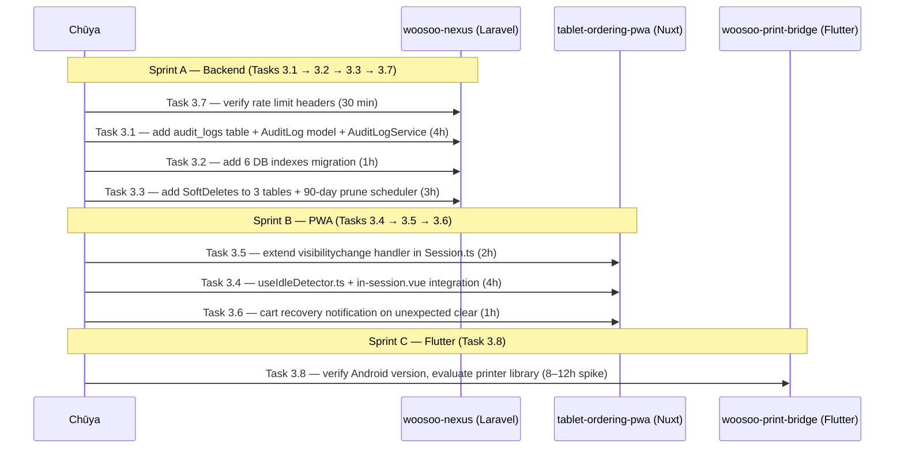

# CASE_FILE: Mission-8 Phase 3 — P2 Hardening
**Apps:** `woosoo-nexus` + `tablet-ordering-pwa` + `woosoo-print-bridge`
**Mission:** Mission-8 Critical Audit Remediation
**Phase:** 3 of 4
**Priority:** P2 (non-blocking — production hardening)
**Status:** 🟡 OPEN — Phase 2 Gate SIGNED by Ranpo Edogawa (April 8, 2026)
**Date:** 2026-04-08

---

## The Mystery

Phase 1 and Phase 2 addressed critical blockers and P1 reliability issues. Phase 3 covers the eight P2 hardening tasks that improve operational visibility, database integrity, security compliance, resilience, and UX resilience. None of these are production blockers — the system can run without them — but each represents a real risk or technical debt that grows over time.

**Severity breakdown:**
- **Database risk (3.1, 3.2, 3.3):** No audit trail, no query optimization indexes, no soft-delete safety net. Accidental deletes are permanent. Status lookups run full table scans.
- **UX resilience (3.4, 3.5, 3.6):** Tablet with an idle session holds a table indefinitely. Wake from sleep can show stale order state. Cart loss on unexpected clear gives no user signal.
- **API compliance (3.7):** Rate-limit headers may be missing on 429 responses. Clients cannot implement proper backoff without `Retry-After`.
- **Hardware risk (3.8):** If relay tablets run Android 13+, `blue_thermal_printer ^1.2.3` will fail silently. This is a time-bomb.

---

## The Blueprint



---

## The Evidence

### 🔴 RISK 3.1 — No Audit Trail (NEXUS-H03)
**App:** `woosoo-nexus`
**Dir:** `apps/woosoo-nexus/`
**Status:** NOT IMPLEMENTED

No `audit_logs` table exists. Order state changes, session lifecycle events, and admin actions leave no persistent trail. Forensic debugging requires parsing PHP logs manually. Cannot prove when an order was voided or who changed a device's assignment.

**Required events to log:**
- Order status changes (PENDING → CONFIRMED → READY → VOID)
- Device registration + re-auth
- Session start + end
- Admin actions (user role changes, device assignment)
- Failed authentication attempts

---

### 🔴 RISK 3.2 — Missing Query Indexes (NEXUS-M04)
**App:** `woosoo-nexus`
**Dir:** `apps/woosoo-nexus/database/migrations/`
**Status:** NOT IMPLEMENTED

Current indexes: none on `device_orders.device_id`, `device_orders.status`, `device_orders.created_at`, `print_events.backend_status`, `print_events.device_order_id`, `devices.token`.

**Impact:** As row counts grow (post-launch orders accumulate), queries filter on these columns constantly. `device_orders.status='pending'` scans the full table today. Not a crisis with <1000 rows; becomes critical at 10k+.

---

### 🟡 RISK 3.3 — No Soft Deletes on Sensitive Tables (NEXUS-M03)
**App:** `woosoo-nexus`
**Tables:** `device_orders`, `devices`, `print_events`
**Status:** NOT IMPLEMENTED

Calling `->delete()` on any of these models permanently destroys the record. One errant admin action or bug in the void handler could erase an order with no recovery path.

**Note:** `deleted_at` is already confirmed absent from `DeviceOrder.php` `$hidden` array (Mission-7 Phase 4 Task 4.1 checked this). The column simply does not exist yet.

---

### 🟡 RISK 3.4 — No Idle Lock on In-Session Page (TABLET-M04)
**App:** `tablet-ordering-pwa`
**Files:**
- `composables/useIdleDetector.ts` ← CREATE
- `pages/order/in-session.vue` ← MODIFY (add idle detection)
**Status:** NOT IMPLEMENTED

A tablet left on the in-session page (e.g., guest leaves without ending session) holds the table indefinitely. No idle timeout exists. Sessions only end via: explicit end button, server-side session end event, or session timer expiry.

**Design:** 2 min idle → show "Are you still there?" modal. 5 min total idle with no response → call session end API → redirect to `/`.

---

### 🟡 RISK 3.5 — Sleep/Wake Handling Incomplete (TABLET-M02)
**App:** `tablet-ordering-pwa`
**Files:**
- `stores/Session.ts` — `_onVisibilityChange` at line 87 ← EXTEND (do NOT add new listener)
**Status:** PARTIAL

**What already exists (Mission-7 Task 2.5):**
`_onVisibilityChange` in `stores/Session.ts` (line 87–103) fires on `visibilitychange` and calls `syncFromServer()` when page becomes visible and session is active. Deduplication guard is in place (remove-before-add on registration).

**What is MISSING:**
1. WebSocket state is not recovered on wake — `useBroadcasts.initializeBroadcasts()` is not called
2. Order polling is not explicitly restarted on wake — if polling timer drifted or was cleared, missed events are never fetched
3. No "hidden > 5 min → force full re-init" logic

**⚠️ CRITICAL CONSTRAINT:** Do NOT add a new `visibilitychange` listener anywhere (not in `app.vue`, not in a plugin). Extend `_onVisibilityChange` in `Session.ts` only. Adding a second listener is a latent bug that causes double `syncFromServer()` calls and double WebSocket reconnects.

**Available APIs for extension:**
- `useBroadcasts().initializeBroadcasts()` — reconnects WebSocket + re-subscribes channels
- `orderStore.startOrderPolling()` — restarts order polling if order is active
- `document.hidden` — to detect current visibility state
- Track last-hidden timestamp: `let _hiddenAt: number | null = null` in Session.ts module scope

---

### 🟡 RISK 3.6 — No Cart Recovery Notification (TABLET-M03)
**App:** `tablet-ordering-pwa`
**Files:** `stores/Order.ts` or `composables/useCartRecovery.ts`
**Status:** NOT IMPLEMENTED

If `localStorage` is cleared unexpectedly (browser error, private mode switch, device crash), the cart loads empty with no user signal. The guest has no idea their selections were lost. They must re-build from scratch silently.

**Design (local-only fallback — 1h approach):**
On cart load in `in-session.vue`, if `hasPlacedOrder` is true but `cartItems` is empty AND `submittedItems` is empty, show a toast/banner: "Your cart was reset — please re-add your items."

---

### 🟡 RISK 3.7 — Rate Limit Headers Not Verified (NEXUS-M05)
**App:** `woosoo-nexus`
**Status:** VERIFICATION REQUIRED

Laravel's `throttle` middleware adds `X-RateLimit-Limit` and `X-RateLimit-Remaining` automatically. The custom `ThrottleByDevice` middleware (Task 1.4, Mission-7) may or may not emit these. `Retry-After` on 429 is not confirmed.

**Required action:** Check all throttled routes. If `Retry-After` is absent, add it.

---

### ⚠️ RISK 3.8 — Printer Library Android Version Risk (BRIDGE-M08)
**App:** `woosoo-print-bridge`
**File:** `apps/woosoo-print-bridge/pubspec.yaml` — `blue_thermal_printer: ^1.2.3`
**Status:** MANUAL HARDWARE AUDIT REQUIRED

`blue_thermal_printer ^1.2.3` has known compatibility issues with Android 13+ (Bluetooth permission model changed). If relay tablets run Android 13+, printing will fail silently in production.

**This task cannot be completed by Chūya without physical access to the relay tablets.** Flag for the President to check Android versions on deployed devices. If Android 13+ confirmed: migrate to `esc_pos_bluetooth: ^0.4.1` (8–12h sprint).

---

## The Verdict — Chūya Handoff

### SPRINT A: Backend (woosoo-nexus) — Independent, run first

#### Task 3.7 — Rate Limit Headers (30 min — do this FIRST)
**Directory:** `apps/woosoo-nexus/`

**Do:**
1. Run `php artisan route:list --path=api | grep throttle` — list all throttled routes
2. Send a test request that hits the rate limit (use `curl` or Postman) — verify `X-RateLimit-Limit`, `X-RateLimit-Remaining`, and `Retry-After` headers are present in 429 responses
3. If `Retry-After` is absent from the `ThrottleByDevice` middleware, add it:
   ```php
   // In ThrottleByDevice.php handle() method, before abort(429):
   return response()->json([
       'success' => false,
       'error' => ['code' => 'RATE_LIMITED', 'message' => 'Too many requests from this device.']
   ], 429, ['Retry-After' => 60]);
   ```

**Don't:**
- Touch the throttle middleware logic — only add the header
- Change rate limits (10/min on create-order is load-tested)

**Acceptance Criteria:**
- [ ] All throttled routes return `X-RateLimit-Limit` + `X-RateLimit-Remaining`
- [ ] 429 response includes `Retry-After: 60` header
- [ ] No PHP lint errors: `php -l app/Http/Middleware/ThrottleByDevice.php`

---

#### Task 3.1 — Audit Log Table (4 hours)
**Directory:** `apps/woosoo-nexus/`

**Create these files:**

1. `database/migrations/2026_04_08_000003_create_audit_logs_table.php`
```php
Schema::create('audit_logs', function (Blueprint $table) {
    $table->id();
    $table->string('event')->index();         // e.g. 'order.status_changed'
    $table->string('subject_type')->nullable(); // e.g. 'DeviceOrder'
    $table->unsignedBigInteger('subject_id')->nullable()->index();
    $table->string('actor_type')->nullable(); // e.g. 'Device', 'User', 'System'
    $table->unsignedBigInteger('actor_id')->nullable();
    $table->json('before')->nullable();
    $table->json('after')->nullable();
    $table->json('meta')->nullable();         // request_id, ip, user_agent
    $table->timestamps();
    $table->index(['subject_type', 'subject_id']);
    $table->index('created_at');
});
```

2. `app/Models/AuditLog.php`
```php
class AuditLog extends Model
{
    protected $fillable = ['event','subject_type','subject_id','actor_type','actor_id','before','after','meta'];
    protected $casts = ['before' => 'array', 'after' => 'array', 'meta' => 'array'];
}
```

3. `app/Services/AuditLogService.php`
```php
class AuditLogService
{
    public static function log(string $event, mixed $subject = null, mixed $actor = null, array $before = [], array $after = [], array $meta = []): void
    {
        AuditLog::create([
            'event' => $event,
            'subject_type' => $subject ? class_basename($subject) : null,
            'subject_id'   => $subject?->id,
            'actor_type'   => $actor ? class_basename($actor) : null,
            'actor_id'     => $actor?->id,
            'before'       => $before ?: null,
            'after'        => $after ?: null,
            'meta'         => $meta ?: null,
        ]);
    }
}
```

**Wire `AuditLogService::log()` into these locations:**
- `DeviceOrderApiController` — after status change: `AuditLogService::log('order.status_changed', $order, $device, ['status' => $old], ['status' => $new])`
- `SessionApiController` — after `start()` and `end()`: `AuditLogService::log('session.started', $session, $device)`
- `DeviceAuthApiController` — after authenticate: `AuditLogService::log('device.authenticated', $device)`
- `DeviceAuthApiController` — on failed auth: `AuditLogService::log('device.auth_failed', null, null, [], [], ['ip' => $request->ip()])`

**Do:**
- Keep `AuditLogService::log()` synchronous (not queued) — audit must be atomic with the action
- Make it a static helper — no need for DI, no constructor
- Do not audit read-only GET endpoints — only state changes

**Don't:**
- Log `password`, `token`, or `api_key` fields in `before`/`after`
- Throw exceptions from `AuditLogService::log()` — wrap the entire body in `try/catch`, log to Laravel log on failure, never crash the request

**Acceptance Criteria:**
- [ ] `php artisan migrate` applies without error
- [ ] `AuditLog::count()` increases after a test order status change
- [ ] `php -l app/Services/AuditLogService.php` — no errors

---

#### Task 3.2 — Database Indexes (1 hour)
**Directory:** `apps/woosoo-nexus/`

**Create:** `database/migrations/2026_04_08_000004_add_performance_indexes.php`
```php
Schema::table('device_orders', function (Blueprint $table) {
    $table->index('device_id');
    $table->index('status');
    $table->index('created_at');
});
Schema::table('print_events', function (Blueprint $table) {
    $table->index('backend_status');
    $table->index('device_order_id');
});
Schema::table('devices', function (Blueprint $table) {
    $table->index('token');
});
```

**Do:**
- Add all 6 indexes in a single migration file
- Run `php artisan migrate` and verify with `SHOW INDEX FROM device_orders;`

**Don't:**
- Add unique constraints (these are query indexes only, not uniqueness enforcement)
- Touch the `devices.token` column definition — index only

**Acceptance Criteria:**
- [ ] `php artisan migrate` — no errors
- [ ] `SHOW INDEX FROM device_orders;` shows `device_id`, `status`, `created_at` indexes
- [ ] `SHOW INDEX FROM print_events;` shows `backend_status`, `device_order_id` indexes
- [ ] `SHOW INDEX FROM devices;` shows `token` index

---

#### Task 3.3 — Soft Deletes (3 hours)
**Directory:** `apps/woosoo-nexus/`

**Add `SoftDeletes` to three models:**
- `app/Models/DeviceOrder.php` — add `use SoftDeletes;` + add to `$casts`: `'deleted_at' => 'datetime'`
- `app/Models/Device.php` — same pattern
- `app/Models/PrintEvent.php` — same pattern

**Create migration:** `database/migrations/2026_04_08_000005_add_soft_deletes_to_core_tables.php`
```php
Schema::table('device_orders', fn($t) => $t->softDeletes());
Schema::table('devices', fn($t) => $t->softDeletes());
Schema::table('print_events', fn($t) => $t->softDeletes());
```

**Add hard-delete cleanup to scheduled commands.** In `routes/console.php`, add:
```php
Schedule::call(function () {
    \App\Models\DeviceOrder::onlyTrashed()->where('deleted_at', '<', now()->subDays(90))->forceDelete();
    \App\Models\Device::onlyTrashed()->where('deleted_at', '<', now()->subDays(90))->forceDelete();
    \App\Models\PrintEvent::onlyTrashed()->where('deleted_at', '<', now()->subDays(90))->forceDelete();
})->daily()->name('hard-delete-old-trashed-records');
```

**Do:**
- Use Laravel's built-in `SoftDeletes` trait — do NOT manually check `deleted_at` in queries
- After adding the trait, any existing `->delete()` calls in controllers become soft-deletes automatically — no controller changes needed
- Verify `RetryUnacknowledgedPrintEvents` job query still works (it filters by `backend_status` — SoftDeletes adds a global scope that excludes trashed; this is correct behavior)

**Don't:**
- Change the void handler logic — it uses `->update()` not `->delete()` (orders are voided via status, not deleted)
- Add `withTrashed()` anywhere unless explicitly required by a task

**Acceptance Criteria:**
- [ ] `php artisan migrate` — no errors
- [ ] Calling `->delete()` on a test DeviceOrder sets `deleted_at`, not removes the row
- [ ] `DeviceOrder::find($id)` returns null after soft-delete (global scope working)
- [ ] `DeviceOrder::withTrashed()->find($id)` returns the soft-deleted row
- [ ] `php artisan schedule:list` shows the hard-delete cleanup command

---

### SPRINT B: PWA (tablet-ordering-pwa) — After Sprint A migrations deployed

#### Task 3.5 — Sleep/Wake Handling Extension (2 hours) — Do BEFORE 3.4
**Directory:** `apps/tablet-ordering-pwa/stores/`
**File:** `Session.ts`

**Read lines 82–106 of `stores/Session.ts` before editing.** The `_onVisibilityChange` handler at line 87 currently calls `syncFromServer()` when visible. Extend it as follows:

**Add at module scope (above `export const useSessionStore`):**
```typescript
// Track last-hidden timestamp for sleep detection
let _hiddenAt: number | null = null
```

**Replace the existing `_onVisibilityChange` function (lines 87–90) with:**
```typescript
const _onVisibilityChange = () => {
  if (typeof document === 'undefined') return
  if (document.hidden) {
    _hiddenAt = Date.now()
    return
  }
  // Page became visible (wake from sleep or tab focus)
  if (!state.isActive) return

  const hiddenMs = _hiddenAt !== null ? Date.now() - _hiddenAt : 0
  _hiddenAt = null

  // Always re-sync session from server
  syncFromServer()

  // Restart order polling if an order is active
  const orderStore = useOrderStore()
  if (orderStore.hasPlacedOrder) {
    orderStore.startOrderPolling()
  }

  // If hidden > 5 min, force WebSocket re-initialization
  if (hiddenMs > 5 * 60 * 1000) {
    try {
      const broadcasts = useBroadcasts()
      broadcasts.initializeBroadcasts()
    } catch (e) {
      logger.warn('[Session] visibilitychange: WebSocket re-init failed (non-fatal)', e)
    }
  }
}
```

**Add to Session.ts imports at top (if not already imported):**
```typescript
import { useOrderStore } from '~/stores/Order'
import { useBroadcasts } from '~/composables/useBroadcasts'
```

**Do:**
- Extend `_onVisibilityChange` only — do NOT add a new `addEventListener('visibilitychange', ...)` anywhere
- Keep the `_registerVisibilitySync` / `_unregisterVisibilitySync` functions unchanged
- Wrap the `useBroadcasts().initializeBroadcasts()` call in try/catch — composable may not be available server-side

**Don't:**
- Add `visibilitychange` listener in `app.vue`, a plugin, or any other file
- Call `broadcasts.initializeBroadcasts()` on every wake — only when hidden > 5 min (unnecessary reconnects cause channel churn)
- Import `useBroadcasts` at the top level of the store module — it must be called inside the function (composable lifecycle)

**Acceptance Criteria:**
- [ ] `npx nuxi typecheck` — zero TypeScript errors
- [ ] Simulating wake (tab hidden → visible) calls `syncFromServer()` — verify via console log
- [ ] Simulating wake after > 5 min calls `initializeBroadcasts()` — verify via console log
- [ ] No second `visibilitychange` listener registered — verify via `getEventListeners(window)` in DevTools

---

#### Task 3.4 — Idle Lock / Auto-Session-End (4 hours)
**Directory:** `apps/tablet-ordering-pwa/`

**Create:** `composables/useIdleDetector.ts`
```typescript
import { ref, onMounted, onUnmounted } from 'vue'

const IDLE_WARN_MS = 2 * 60 * 1000  // 2 min — show "Are you still there?"
const IDLE_END_MS  = 5 * 60 * 1000  // 5 min — end session

export function useIdleDetector(onWarn: () => void, onEnd: () => void) {
  const isIdle = ref(false)
  let warnTimer: ReturnType<typeof setTimeout> | null = null
  let endTimer:  ReturnType<typeof setTimeout> | null = null

  const resetTimers = () => {
    isIdle.value = false
    if (warnTimer) clearTimeout(warnTimer)
    if (endTimer)  clearTimeout(endTimer)
    warnTimer = setTimeout(() => { isIdle.value = true; onWarn() }, IDLE_WARN_MS)
    endTimer  = setTimeout(onEnd, IDLE_END_MS)
  }

  const ACTIVITY_EVENTS = ['touchstart', 'touchmove', 'click', 'keydown', 'mousemove'] as const

  onMounted(() => {
    ACTIVITY_EVENTS.forEach(e => window.addEventListener(e, resetTimers, { passive: true }))
    resetTimers()
  })

  onUnmounted(() => {
    ACTIVITY_EVENTS.forEach(e => window.removeEventListener(e, resetTimers))
    if (warnTimer) clearTimeout(warnTimer)
    if (endTimer)  clearTimeout(endTimer)
  })

  return { isIdle, resetTimers }
}
```

**Modify:** `pages/order/in-session.vue`
- Import `useIdleDetector` and wire `onWarn` to show the "Are you still there?" modal
- Wire `onEnd` to call session end API then `navigateTo('/')`
- Add a modal component (use existing `el-dialog` or a simple Tailwind div) with "I'm still here" button that calls `resetTimers()`

**Do:**
- Call `resetTimers()` when user taps "I'm still here" button
- Clear timers in `onUnmounted` (already done in the composable — do not duplicate in the page)
- Show a countdown in the modal ("Ending session in 3 min...")

**Don't:**
- Use `setInterval` for the countdown display — use a single `ref` updated every second with `setInterval` inside the modal open handler, cleared when modal closes
- Call session end API more than once (add a `let isEnding = false` guard)

**Acceptance Criteria:**
- [ ] Page visible for 2 min without touch → modal appears
- [ ] Tapping "I'm still here" → modal closes, timers reset
- [ ] 5 min total idle → session end API called → redirect to `/`
- [ ] `npx nuxi typecheck` — zero errors
- [ ] Navigating away from in-session page → timers cleared (no memory leak)

---

#### Task 3.6 — Cart Recovery Notification (1 hour)
**Directory:** `apps/tablet-ordering-pwa/pages/order/`
**File:** `in-session.vue`

On `onMounted` in `pages/order/in-session.vue`, after store hydration:
```typescript
// Cart recovery check
if (orderStore.hasPlacedOrder && !orderStore.cartItems?.length && !orderStore.submittedItems?.length) {
  showCartLostToast() // use existing toast/notification system
}
```

**Do:**
- Use the existing notification system (check `composables/useNotification.ts` or equivalent — do not create a new toast system)
- Show message: `"Your selections were reset. Please re-add items if needed."`
- Show it only once per session (track with a `ref` flag — `const cartRecoveryShown = ref(false)`)

**Don't:**
- Block the page render waiting for this check
- Throw if `cartItems` is undefined — use optional chaining

**Acceptance Criteria:**
- [ ] Toast appears when order placed + cart empty + no submitted items
- [ ] Toast does NOT appear on normal flow (submitted items present)
- [ ] `npx nuxi typecheck` — zero errors

---

### SPRINT C: Flutter (woosoo-print-bridge) — Parallel, requires hardware

#### Task 3.8 — Printer Library Evaluation (MANUAL — escalate to President)
**This task requires physical access to relay tablets.**

**Step 1:** On the relay tablet, go to Settings → About → Android Version.

**If Android < 13 (API 32 or below):** No action required. Document version and close task.

**If Android 13+ (API 33+):**
1. Run spike: `flutter pub add esc_pos_bluetooth` in `apps/woosoo-print-bridge/`
2. Evaluate compatibility with existing `lib/services/printer/printer_blue_thermal.dart`
3. Estimate migration effort — report back to Ranpo before writing any code

**Do NOT start the migration without Ranpo architectural review.**

---

## Execution Order (Strict)

```
3.7 (verify, 30 min) →
3.1 (audit log, 4h) →
3.2 (indexes, 1h) →
3.3 (soft deletes, 3h) →
php artisan migrate (all 4 new migrations) →
[PARALLEL]:
  3.5 (Session.ts extend, 2h)
  3.6 (cart recovery notification, 1h)
→ 3.4 (idle lock, 4h — after 3.5 is done)
→ 3.8 (manual hardware audit, async)
```

---

## Required Tests (per task)

```bash
# Task 3.7
php artisan route:list --path=api | grep throttle
# Manually test 429 — verify Retry-After header

# Task 3.1
php artisan migrate
php -l app/Services/AuditLogService.php
php -l app/Models/AuditLog.php

# Task 3.2 + 3.3
php artisan migrate
php artisan tinker --execute="DB::statement('SHOW INDEX FROM device_orders')"

# Task 3.5 + 3.4 + 3.6
cd apps/tablet-ordering-pwa
npx nuxi typecheck
```

---

## Failure Modes to Simulate

- `AuditLogService::log()` throws internally → must NOT crash the request (catch + Laravel log)
- Tablet wakes after 10 min sleep → `initializeBroadcasts()` called once → WebSocket restores within 30s
- Idle modal appears → network drops before session end API → show error, do NOT redirect
- Cart recovery toast → should NOT fire if `submittedItems` has items (user already ordered)
- Soft-delete a `Device` → `RetryUnacknowledgedPrintEvents` must still find its `print_events` (global scope from SoftDeletes adds `WHERE deleted_at IS NULL` automatically — verify the job query still works)

---

## Phase 3 Gate Criteria (Ranpo Sign-Off)

- ✅ All 4 backend migrations apply cleanly on a fresh DB
- ✅ AuditLog records appear after order status change (manual test)
- ✅ `SHOW INDEX FROM device_orders` confirms 3 new indexes
- ✅ Soft-delete verified on all 3 tables via Tinker
- ✅ `npx nuxi typecheck` — zero errors after Tasks 3.4, 3.5, 3.6
- ✅ `visibilitychange` listener count is 1 (not 2) — DevTools verification
- ✅ Task 3.8 either: hardware audit complete + version documented, OR escalated to President with Android version confirmed
- ✅ No regressions: all existing tests still pass
