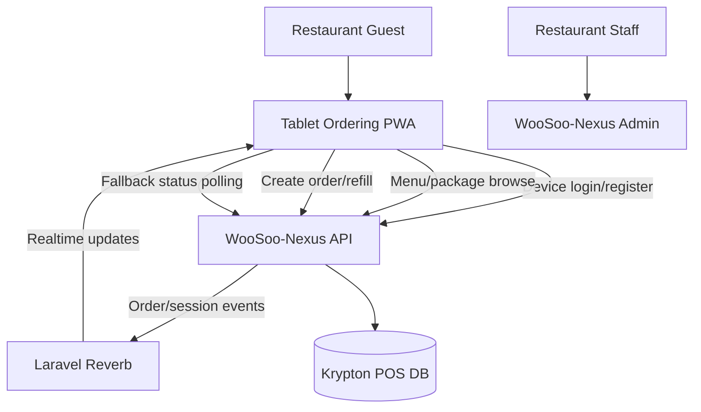
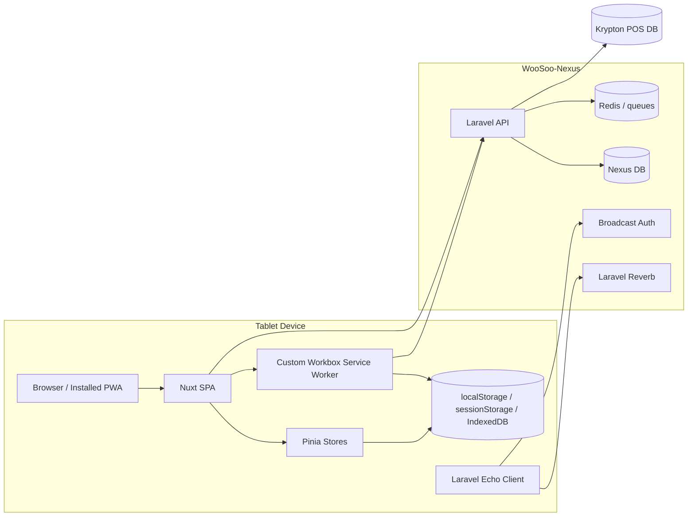
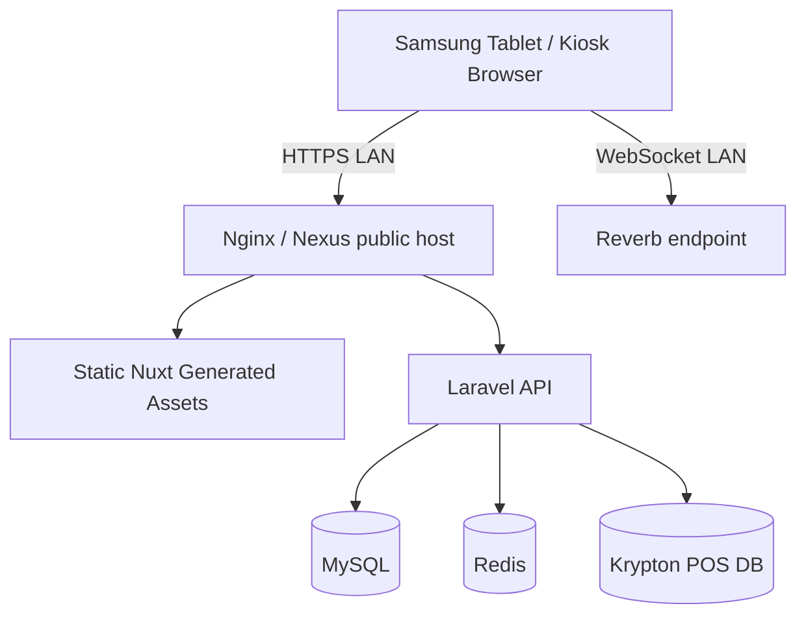
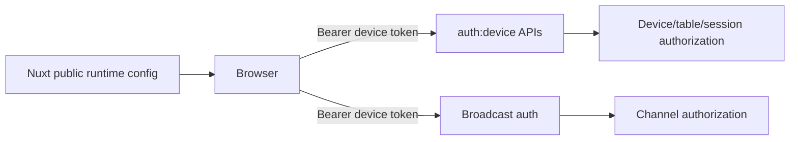

# Tablet Ordering PWA Architecture Review

## Repository

- Repository: `tech-artificer/tablet-ordering-pwa`
- Source branch: `staging`
- Documentation branch: `docs/technical-review`

## Architectural Classification

The Tablet Ordering PWA is a Nuxt 3 single-page application designed for kiosk/tablet use in a local-network restaurant environment. It depends on WooSoo-Nexus for device authentication, menu/package APIs, order submission, sessions, and realtime status events.

## Technology Stack

| Layer | Technology |
|---|---|
| App framework | Nuxt 3 |
| UI runtime | Vue 3 |
| State management | Pinia |
| Persistence | pinia-plugin-persistedstate, localStorage, sessionStorage |
| Offline/local DB | Dexie present, offline queue composables/store present |
| PWA | @vite-pwa/nuxt with injectManifest |
| Service worker | Custom `public/sw.ts` using Workbox |
| Realtime | Laravel Echo + Pusher JS against Laravel Reverb |
| Testing tools | Vitest, Vue Test Utils, Playwright, fake-indexeddb |

## System Context

## Container View

## Major Runtime Responsibilities

### Nuxt SPA

- Render kiosk/tablet screens.
- Run global authentication middleware.
- Manage package selection, cart, order state, session state, and settings lock state.
- Initialize runtime config for API and Reverb.

### Pinia Stores

- `Device.ts`: device token, device/table assignment, broadcast config, token refresh, table polling.
- `Order.ts`: package/cart/refill state, order payload construction, order submission, idempotency key lifecycle, polling fallback.
- `Session.ts`: active session/order metadata and session reset/end behavior.
- `OfflineSync.ts`: offline sync state coordination.

### Service Worker

- Precaches Nuxt build assets.
- Provides SPA navigation fallback while excluding API/backend/admin paths.
- Runtime-caches `/api/menus` using NetworkFirst.
- Runtime-caches images using CacheFirst.
- Queues `POST /api/devices/create-order` using Workbox Background Sync for up to two hours.

### Realtime Layer

- Uses Laravel Echo with the `reverb` broadcaster.
- Loads broadcast config from persisted device auth response, `/api/config`, or runtime fallback.
- Adds Bearer token auth headers for private/presence channel authorization.
- Updates Echo auth headers after token refresh.

## Deployment View

## Security Boundaries

### Boundary Notes

- Anything in `runtimeConfig.public` is visible to the browser and must not be treated as secret.
- Persisted device tokens in localStorage require kiosk-level physical device trust.
- Backend must enforce device/table/session ownership; frontend checks are not a security boundary.
- Broadcast channel authorization must match REST API authorization.

## Critical Architecture Risks

| Severity | Risk | Impact | Required Control |
|---|---|---|---|
| P1 | Public device passcode used as secret | Unauthorized device provisioning | Move authorization to server-issued one-time setup codes |
| P1 | Offline replay after stale session | Wrong table/session order | Backend must bind idempotency key to device/session/table |
| P1 | Token stored in localStorage | Token theft on compromised tablet | Token expiry, scoped abilities, reset/logout clearing |
| P1 | Reverb/polling double application | Duplicate state transitions | Idempotent state handlers keyed by session/order id |
| P2 | TypeScript strictness disabled | Weak API contract confidence | Add CI typecheck and runtime validators |
| P2 | `/api/menus` cache may miss v2 tablet APIs | Incomplete offline menu behavior | Extend cache policy intentionally or document online-only v2 |

## Recommended Architecture Standards

1. Treat WooSoo-Nexus as the source of truth for order/session state.
2. Treat the PWA as an eventually-consistent client with local optimistic UX only.
3. Every order mutation must carry an idempotency key.
4. Every realtime event must include enough identifiers to reject stale events.
5. Every local persisted state key must have a reset condition.
6. Every API response used by the PWA must have a documented contract.
7. Every offline queue replay must be safe after token refresh, table reassignment, and POS session changes.
