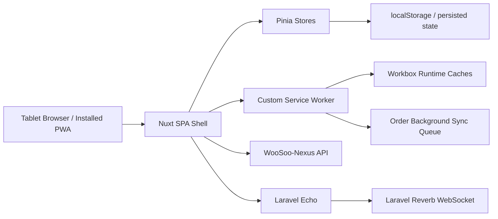

# CASE_FILE: Tablet Ordering PWA Technical Review

## Scope

Repository: `tech-artificer/tablet-ordering-pwa`

Reference branch: `staging`

Documentation branch: `docs/technical-review`

This case file documents the initial reverse-engineering and review posture for the Tablet Ordering PWA. It is documentation-only and must not modify runtime application behavior.

## Confirmed Platform

- Nuxt `^3.17.4`
- Vue `^3.5.24`
- Pinia `^3.0.3`
- `pinia-plugin-persistedstate`
- Dexie `^4.4.2`
- Laravel Echo `^2.1.5`
- Pusher JS `^8.4.0`
- Vite PWA / Workbox via `@vite-pwa/nuxt`
- Vitest, Playwright, fake-indexeddb, Vue Test Utils
- Node `>=20.18.0`

## Confirmed Runtime Architecture

The application is configured as an SPA with `ssr: false`. It uses Nuxt routing, a global auth middleware, Pinia stores, a custom Workbox service worker, and Laravel Echo for Reverb-based realtime events.

## Confirmed Core Surfaces

- `nuxt.config.ts`
- `public/sw.ts`
- `stores/Device.ts`
- `stores/Order.ts`
- `stores/Session.ts`
- `stores/OfflineSync.ts`
- `plugins/echo.client.ts`
- `middleware/auth.global.ts`
- `pages/order/packageSelection.vue`
- `pages/order/in-session.vue`
- `components/order/CartDrawer.vue`
- `composables/useSessionEndFlow.ts`
- `composables/useGuestReset.ts`

## Initial Findings

### Strong Existing Practices

- Order submission uses a central `isSubmitting` flag.
- Initial order submission uses `X-Idempotency-Key` persisted in `sessionStorage` across retries.
- Offline path generates/reuses the same idempotency key before queuing.
- Workbox Background Sync queues `POST /api/devices/create-order` for up to two hours.
- Echo initialization avoids redefining Nuxt injection after token refresh.
- Device authentication state persists selected fields only.
- Table polling has max attempts and runtime guard.

### Audit Flags

#### P1: Public Device Auth Passcode

`deviceAuthPasscode` is exposed in public runtime config. Because Nuxt public runtime config is client-visible, this must not be treated as a secret. If this value is used as a privileged registration credential, the boundary is weak.

Required follow-up:

- Confirm whether the setup code is only a convenience hint or an authorization secret.
- Prefer server-side security codes, one-time setup codes, or staff-authenticated provisioning.

#### P1: Offline Order Replay Contract

The service worker treats `201` and `409` as successful replay outcomes. This is good, but correctness depends on backend idempotency semantics.

Required follow-up:

- Confirm backend stores and enforces `X-Idempotency-Key` per device/session.
- Confirm conflict response includes enough order data for safe resume.
- Confirm queued requests cannot replay after session/table ownership changes.

#### P1: Stored Device Token

Device token is persisted in localStorage through Pinia persisted state. This is common for kiosk apps but must be treated as a physical-device trust boundary.

Required follow-up:

- Confirm token expiry and refresh behavior.
- Confirm logout/reset clears persisted token and session order id.
- Confirm stolen token cannot access unrelated table/session/order data.

#### P2: TypeScript Strictness Disabled

`typescript.strict` and `typeCheck` are disabled. This reduces contract confidence between frontend state, API responses, and event payloads.

Required follow-up:

- Introduce typecheck in CI before production hardening.
- Add runtime schema guards for critical API/event payloads.

## Race Condition Checklist

- [ ] Duplicate order double-tap blocked in UI.
- [ ] Duplicate order retry blocked through backend idempotency.
- [ ] Offline queue and manual retry cannot create separate orders.
- [ ] Reverb completion event cannot reset the wrong session.
- [ ] Polling fallback and Reverb event cannot double-apply terminal state.
- [ ] Token refresh cannot recreate Echo and orphan listeners.
- [ ] Cart mutations are blocked after initial order placement.
- [ ] Refill submission cannot target completed/cancelled order.

## Security Checklist

- [ ] Public runtime config contains no secrets.
- [ ] Device token scope is limited to assigned device/table/session.
- [ ] Reverb auth endpoint uses Bearer device token.
- [ ] Stored token is cleared on logout/session reset.
- [ ] Settings PIN/passcode is not security-critical.
- [ ] API base URL and Reverb host are environment-controlled.
- [ ] Debug logs do not expose tokens/order PII in production.

## State Integrity Checklist

- [ ] Order store statuses match Nexus statuses.
- [ ] Session store order id uses canonical `order_id`, not ambiguous database id/order number.
- [ ] Backend 409 resume payload matches frontend `setOrderCreated` expectations.
- [ ] Offline replay success payload matches normal order creation payload.
- [ ] Session end flow clears cart, order id, and idempotency key.
- [ ] Table assignment changes do not preserve stale active order.

## Test Sufficiency Checklist

- [ ] Unit tests for `buildPayload` package/modifier structure.
- [ ] Unit tests for `submitOrder` idempotency key lifecycle.
- [ ] Unit tests for `DeviceStore` token refresh and table polling.
- [ ] Unit tests for Echo init/reinit auth header behavior.
- [ ] fake-indexeddb tests for offline queue persistence.
- [ ] Playwright E2E for package selection to order submission.
- [ ] Playwright E2E for offline order queue and replay.
- [ ] Playwright E2E for Reverb disconnect with polling fallback.

## Open Questions

1. Is `NUXT_PUBLIC_DEVICE_AUTH_PASSCODE` still required?
2. Does the backend persist idempotency keys or only throttle requests?
3. What is the canonical session reset event payload?
4. What exact Reverb channels/events does the PWA subscribe to?
5. Should menu cache include `/api/v2/tablet/*` endpoints, not only `/api/menus`?
6. What is the expected behavior when a queued order replays after the POS session closes?

## Handover

Continue the documentation pass by generating architecture, workflow, API contract, PWA offline specification, and testability audit documents under `docs/technical-review`.
