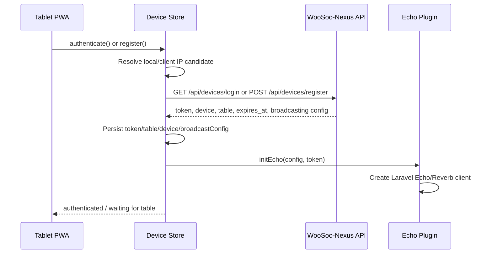
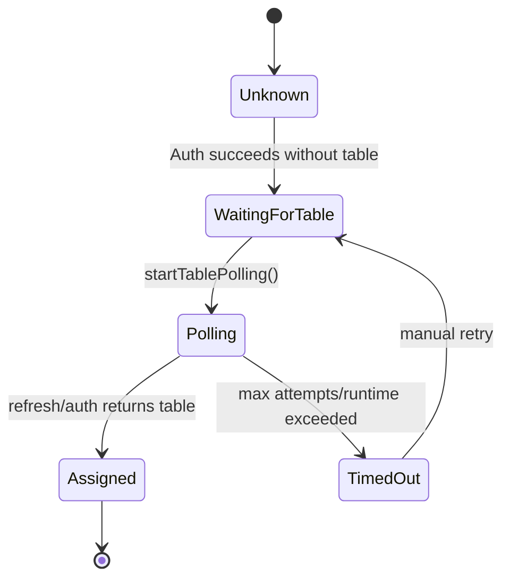
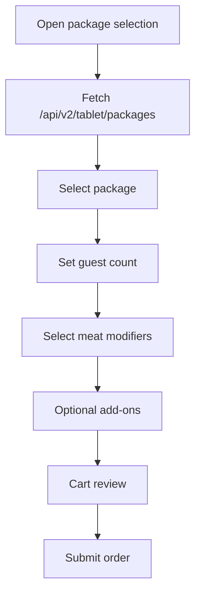
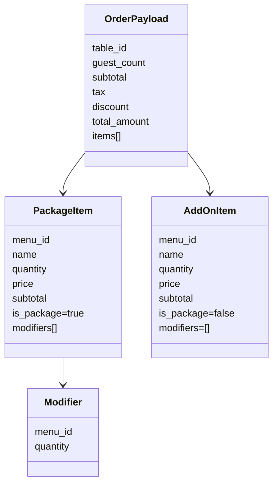
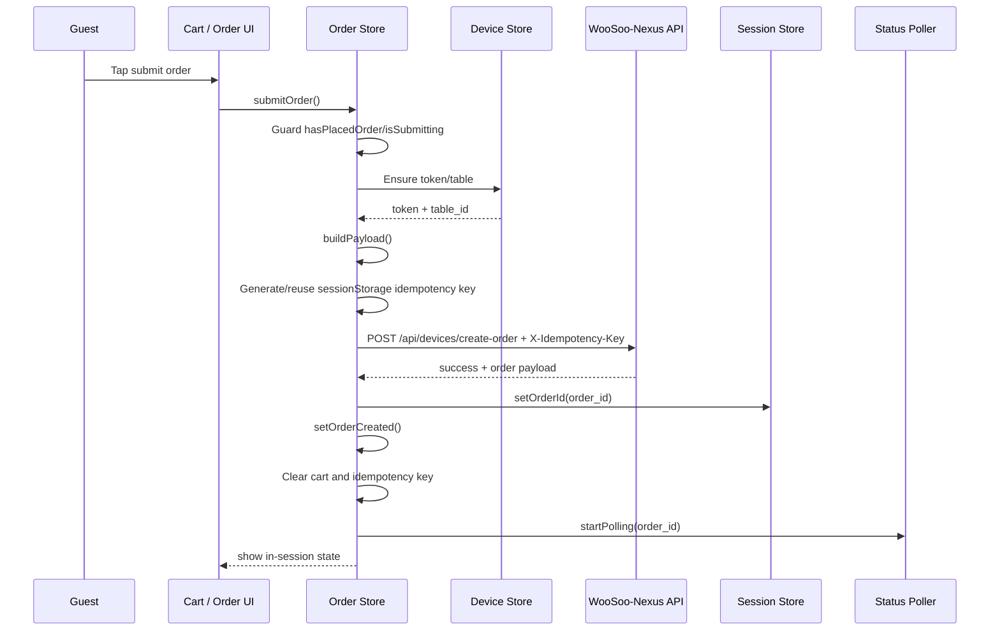
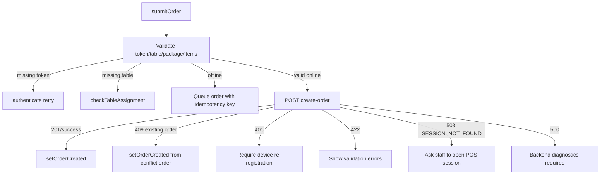
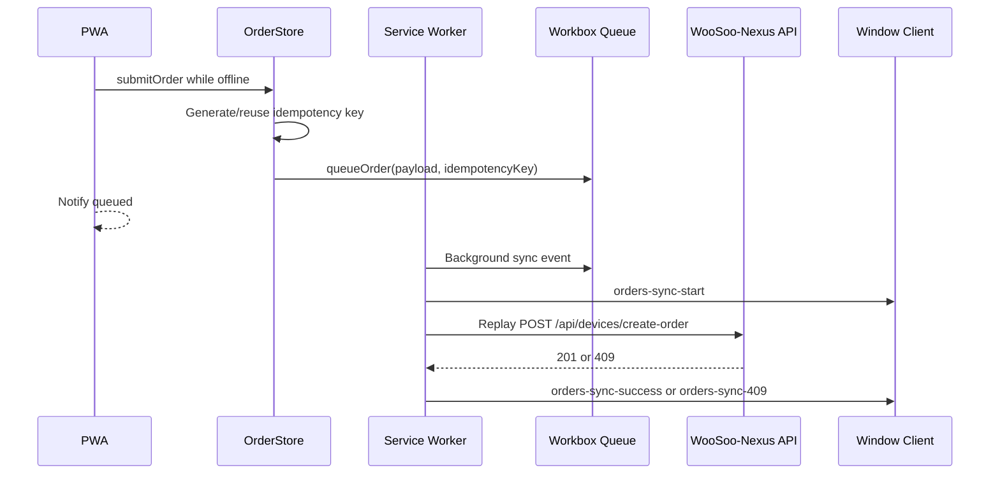
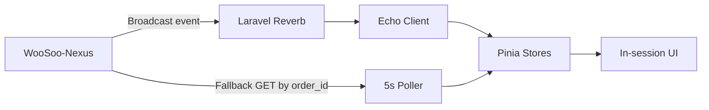
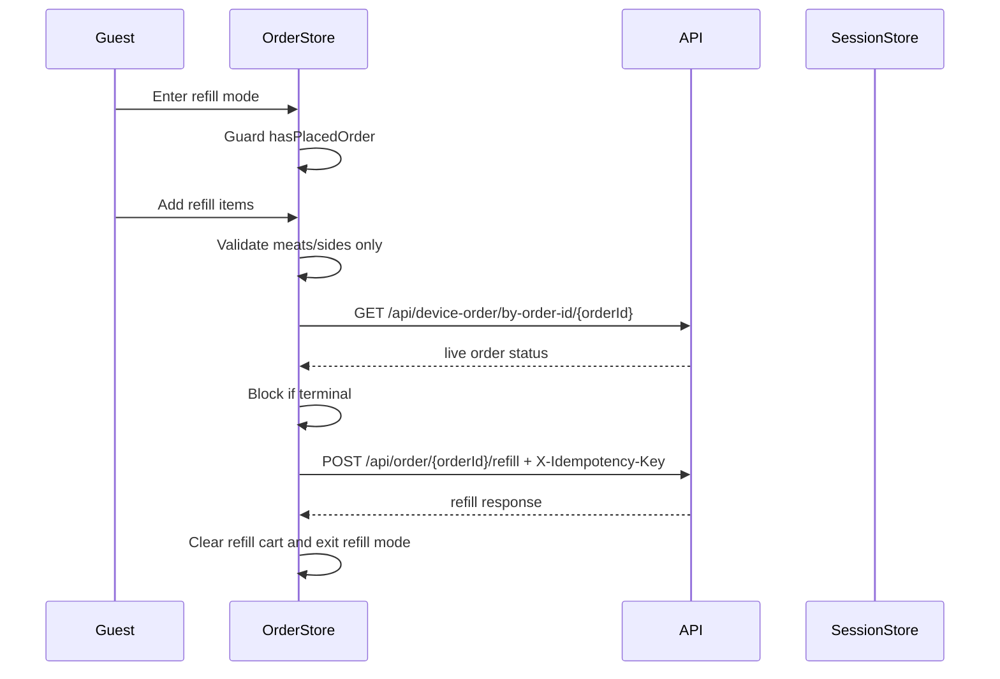
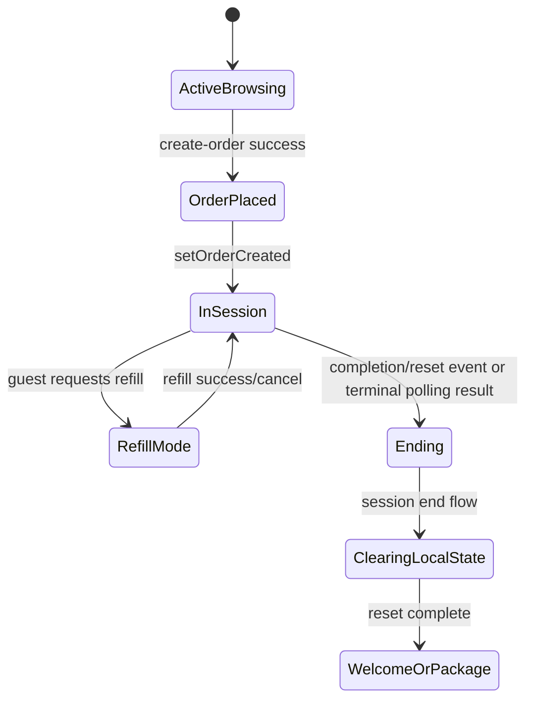

# Tablet Ordering PWA Workflow Review

## Scope

This document traces major Tablet Ordering PWA workflows as implemented or implied by the `staging` branch.

## 1. Device Authentication / Registration

### Integrity Requirements

- Token must belong to the physical tablet/device.
- Device must be assigned to exactly one active table context.
- Broadcast config returned by the backend should be the preferred source of truth.
- Registration passcodes/security codes must not be treated as client-side secrets.

## 2. Table Assignment Polling

### Integrity Requirements

- Polling must stop on table assignment.
- Polling must stop on timeout.
- Existing stale table state must be cleared on logout/reset.

## 3. Package Selection and Cart Build

### Payload Contract

The order payload is constructed with one top-level package item and meat items as nested modifiers. Add-ons are sent as separate top-level items.

## 4. Initial Order Submission

### Error Branches

## 5. Offline Order Queue and Replay

### Offline Replay Requirements

- Replay must carry original idempotency key.
- Replay must not create an order for a stale session/table.
- `409` must mean safe resume, not unknown conflict.
- UI must reconcile queued success with current session state.

## 6. Realtime and Polling Status Updates

### Integrity Requirements

- Reverb and poller handlers must be idempotent.
- Events must include order/session/table identifiers.
- Stale completion events must be ignored if the tablet has already joined a new session.
- Polling must stop after terminal state or session reset.

## 7. Refill Submission

## 8. Session End / Reset

### Reset Requirements

- Clear cart and refill cart.
- Clear submitted items.
- Clear current order and session order id.
- Clear idempotency key.
- Stop polling.
- Preserve only safe kiosk/device configuration.

## Workflow Gaps to Validate Against Backend

1. Backend idempotency storage and conflict semantics.
2. Exact broadcast event names, channel names, and payloads.
3. Whether queued orders are bound to the same POS terminal session.
4. Whether v2 menu APIs are intentionally online-only.
5. Whether completion/reset event includes session id and order id.
6. Whether refill endpoint enforces same constraints as frontend.
