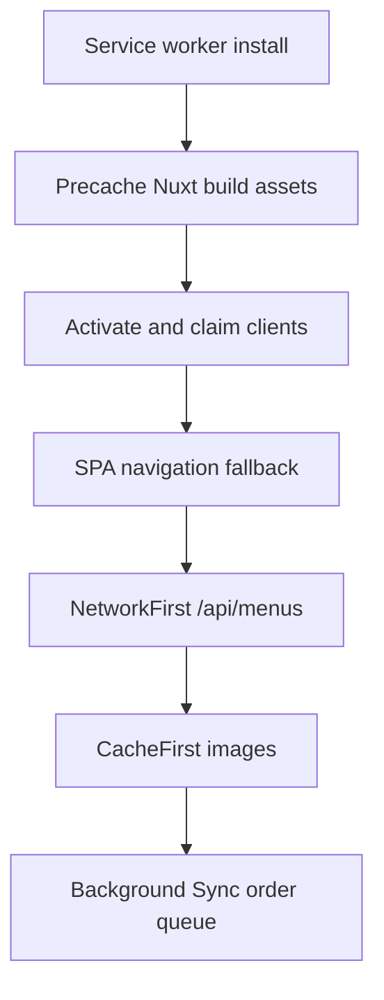
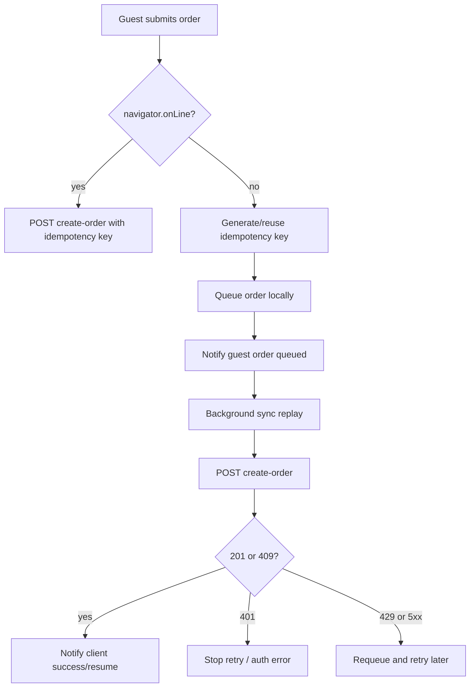

# Tablet Ordering PWA Offline and Testability Review

## Offline Strategy

The PWA uses a custom Workbox service worker through `injectManifest`.

## Confirmed Service Worker Responsibilities



## Runtime Cache Policies

| Resource | Strategy | TTL | Notes |
|---|---|---:|---|
| Nuxt build assets | Precache | Build revision | Generated by Workbox manifest |
| Navigation shell | NavigationRoute fallback to `/` | Build revision | Excludes API/backend/admin paths |
| `/api/menus` | NetworkFirst | 1 day | Does not obviously include `/api/v2/tablet/*` |
| Images | CacheFirst | 7 days | Max 200 entries |
| `POST /api/devices/create-order` | NetworkOnly + BackgroundSyncPlugin | 2 hours | Queued on network failure |

## Offline Order Submission Flow



## Offline Risks

| Severity | Risk | Explanation | Required Control |
|---|---|---|---|
| P1 | Stale queued order | A queued request may replay after the table/session/POS session changed | Backend must validate idempotency key against device/session/table and active POS session |
| P1 | Duplicate order via mixed retry paths | Manual retry and SW queue may both submit | Same idempotency key must be reused and backend-enforced |
| P1 | UI reconciliation mismatch | SW postMessage response may differ from normal create-order response | Normalize replay payload before applying order state |
| P2 | Menu cache mismatch | Current SW pattern caches `/api/menus`, while tablet app primarily uses `/api/v2/tablet/*` | Decide whether v2 tablet browse APIs should be cached |
| P2 | Token expiry during replay | Queued request may replay with expired Bearer token | Refresh token before replay or allow safe 401 recovery UX |

## Recommended Offline Acceptance Criteria

1. Installed PWA shell loads without network after first successful load.
2. Previously viewed images remain visible offline.
3. Menu/package behavior is explicitly defined as cached or online-only.
4. Offline order submit queues exactly one order with one idempotency key.
5. Replaying the same queued request twice returns or resumes the same order.
6. Expired token during replay does not silently lose the order.
7. Queued order after session reset is rejected safely with actionable UI.
8. Background sync messages do not double-call `setOrderCreated`.

## Test Plan

### Unit Tests

| Test | Target | Expected Result |
|---|---|---|
| Build package payload | `Order.ts buildPayload` | Package is top-level item; meats are modifiers; add-ons are standalone |
| Prevent duplicate submit | `Order.ts submitOrder` | `isSubmitting` blocks second call |
| Idempotency key persistence | `Order.ts submitOrder` | Key survives failure and clears after success |
| Offline queue key reuse | offline queue composable | Same key is sent on replay |
| Refill guard | `Order.ts submitRefill` | Completed/cancelled orders cannot receive refill |
| Device token refresh | `Device.ts refresh/startRefreshTimer` | Refresh called near expiry |
| Table polling timeout | `Device.ts startTablePolling` | Polling stops on max attempts/runtime |
| Echo auth update | `echo.client.ts` | Token refresh updates Authorization header without reinjecting `$echo` |

### Component Tests

| Screen/Component | Required Scenarios |
|---|---|
| Package selection | all packages visible on target tablet size; selected package state persists |
| Cart drawer | submit button disabled while submitting; totals correct |
| In-session screen | placed order shown; refill mode toggles correctly |
| Device registration | invalid code, waiting-for-table, successful table assignment |
| Session end banner | terminal state displays reset/end UX correctly |

### E2E Tests


Required E2E scenarios:

1. Happy path: package selection to successful order.
2. Double tap submit: only one order is created.
3. Offline submit: order is queued, then replayed after network restore.
4. Reverb disconnect: polling fallback eventually updates order.
5. Terminal status: completed order resets session exactly once.
6. Refill path: only allowed items can be refilled.
7. Expired token: user receives clear re-registration flow.
8. No table assigned: app enters waiting-for-table state.

## Production Readiness Criteria

The PWA can be considered production-ready only when:

- Backend idempotency is confirmed and tested.
- API/event contracts are documented and schema-tested.
- Offline queue replay is tested against session/table changes.
- Reverb disconnect and polling fallback have automated tests.
- Runtime config contains no secrets.
- Typecheck is enabled in CI or justified with compensating runtime validation.
- Tablet viewport `1340x800` is covered by visual/E2E tests.
- Session reset clears all mutable order/session state.

## Recommended CI Commands

```bash
npm run lint
npm run typecheck
npm run test:run
npx playwright test
npm run build
```

## Test Data Requirements

- Registered active device with table assignment.
- Device without table assignment.
- Active POS terminal session.
- Missing POS terminal session.
- Package with meat modifiers.
- Package with taxable and non-taxable variations.
- Add-on item with price.
- Existing active order for conflict/resume path.
- Completed order for terminal/refill blocking path.
